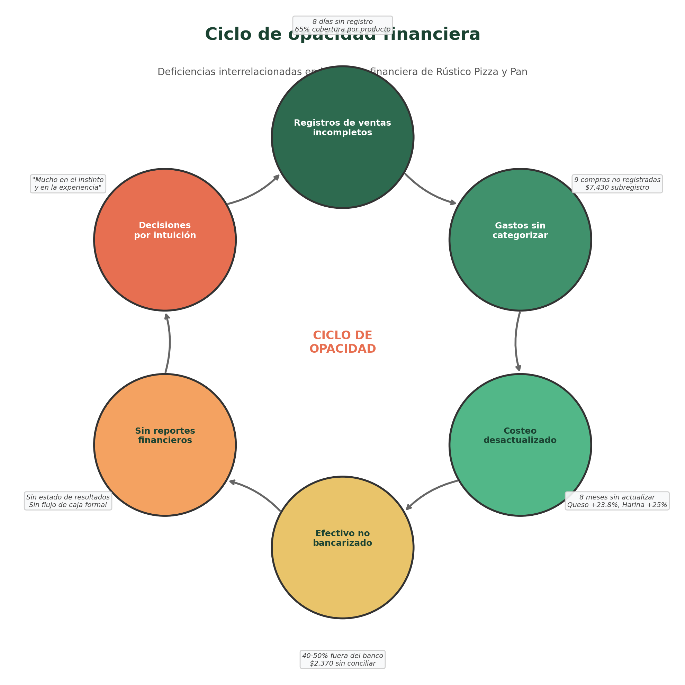
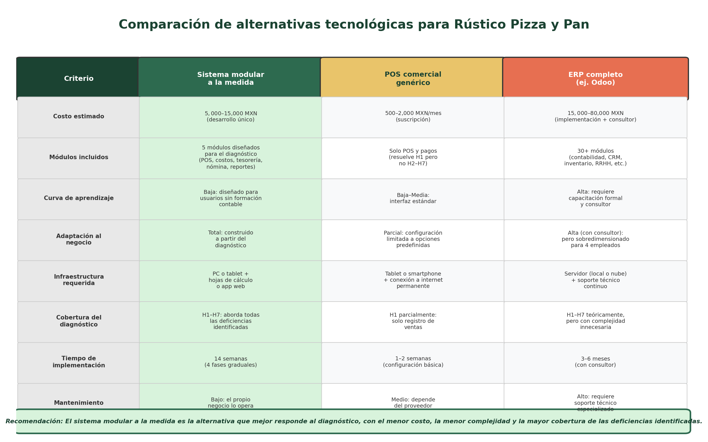
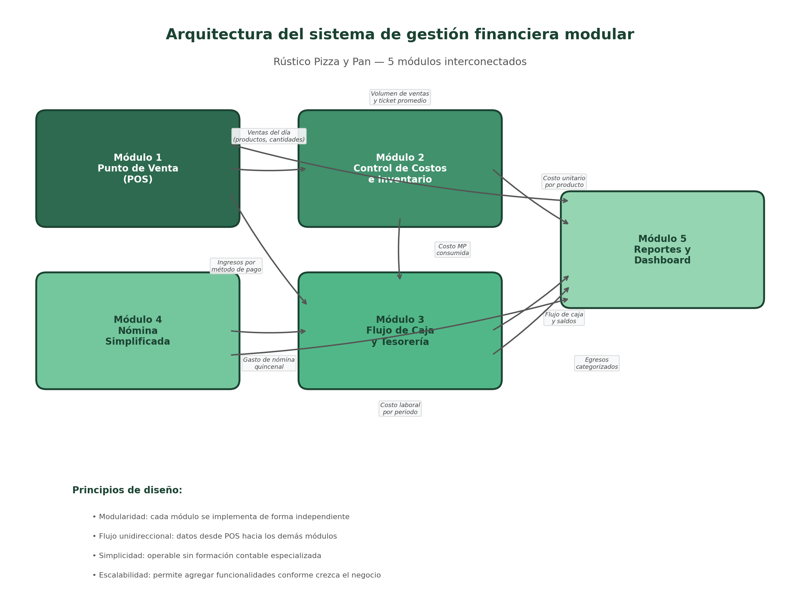
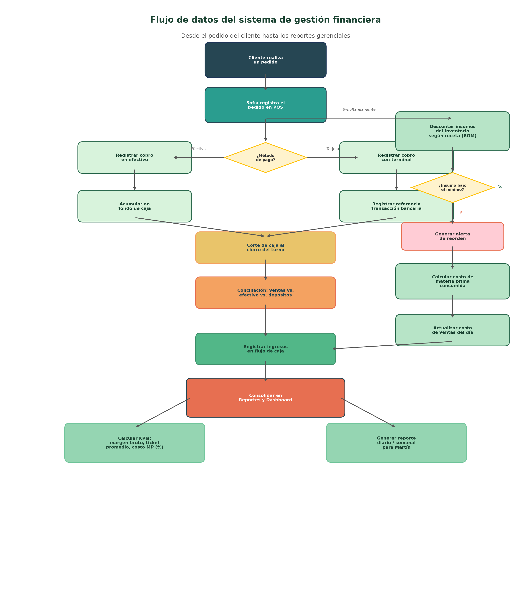
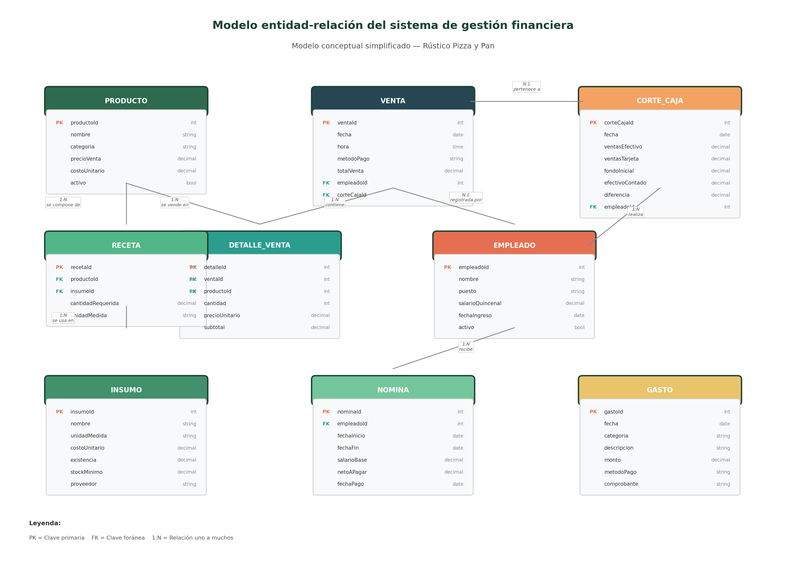

# Capítulo 7. Análisis e interpretación de resultados

## 7.1 Marco metodológico

### 7.1.1 Tipo de investigación: cualitativa

La presente investigación adopta un enfoque cualitativo para diagnosticar la gestión financiera de Rústico Pizza y Pan, microempresa del sector restaurantero ubicada en la colonia Ventura Puente de Morelia, Michoacán. Se eligió este enfoque porque el objetivo del estudio no es medir frecuencias ni establecer correlaciones estadísticas, sino comprender en profundidad cómo opera la gestión financiera dentro de una microempresa específica, identificar las prácticas informales que la caracterizan y diagnosticar las brechas entre la situación actual y las prácticas recomendadas por la literatura especializada.

**Justificación del enfoque cualitativo frente al cuantitativo.** Un enfoque cuantitativo resultaría inadecuado para esta investigación por tres razones fundamentales. En primer lugar, se trata de un estudio de caso único: la unidad de análisis es una sola microempresa, lo que impide la construcción de muestras estadísticamente representativas y la aplicación de técnicas de inferencia. En segundo lugar, los registros financieros del negocio son informales, heterogéneos e incompletos —la libreta de gastos presenta un subregistro del 12.6%, el registro de ventas tiene ocho días sin datos y el inventario cubre solo entre 12 y 15 de aproximadamente 50-60 insumos—, lo que significa que los datos disponibles no cumplen los requisitos de estandarización y completitud que exigen los métodos estadísticos. En tercer lugar, los fenómenos que se busca comprender —las prácticas de registro, las lógicas de decisión del propietario, las dinámicas informales de gestión— son de naturaleza interpretativa y contextual, no reducibles a variables numéricas sin perder su significado.

**Pertinencia del estudio de caso único.** El diseño de la investigación es de tipo descriptivo y exploratorio, orientado al estudio de caso único. Yin (2018) argumenta que el estudio de caso único se justifica cuando se presenta un caso revelador, es decir, cuando el investigador tiene la oportunidad de observar y analizar un fenómeno que previamente era inaccesible para la investigación científica. Rústico Pizza y Pan reúne esta característica: las prácticas financieras internas de una microempresa familiar del sector restaurantero rara vez son accesibles para un análisis externo, porque operan en un ámbito privado donde los registros son personales y las decisiones se toman informalmente. La apertura de los propietarios para compartir documentos, acceso a cuentas bancarias y testimonios detallados constituye una oportunidad de observación que justifica el diseño de caso único.

**Pertinencia para microempresas.** El enfoque cualitativo resulta particularmente pertinente para el estudio de microempresas porque, como señala la literatura, este tipo de organizaciones opera con dinámicas que no siempre son capturables mediante instrumentos estandarizados: los registros son informales, las decisiones se basan en la experiencia del propietario y las prácticas financieras están profundamente ligadas al contexto familiar y operativo del negocio. En este sentido, García-Moreno et al. (2019) argumentan que "la investigación documental permite analizar los resultados de estudios empíricos y fuentes secundarias para identificar los factores que determinan el nivel de gestión financiera en las PyMES, lo que facilita un diagnóstico situacional financiero que promueva la competitividad empresarial".[^1] La informalidad de los registros hace que los datos no sean capturables con instrumentos estandarizados: una libreta con manchas de café y páginas desprendidas, notas de proveedor acumuladas en una bolsa de plástico y cantidades de inventario anotadas con signos de interrogación ("Champiñones — 0.8 kg (?)") son fuentes de información que requieren interpretación cualitativa, no codificación estadística.

**Periodo de análisis.** El periodo de análisis comprende los meses de diciembre de 2025 a febrero de 2026, lapso que permite observar tanto la operación regular como los picos estacionales. Este periodo es representativo porque incluye temporada alta (diciembre, con eventos navideños y mayor afluencia familiar) y temporada de ajuste (enero, típicamente el mes más bajo en ventas para el sector restaurantero), lo que permite capturar la variabilidad estacional del negocio y evitar conclusiones sesgadas por un periodo atípico. Los promedios diarios de ventas registrados confirman esta variabilidad: $3,467 en diciembre, $3,892 en enero y $4,115 en febrero.

### 7.1.2 Técnicas e instrumentos de recolección

Para la recolección de datos se emplearon tres técnicas complementarias que, en conjunto, permiten triangular la información y fortalecer la credibilidad de los hallazgos: la entrevista semiestructurada, la observación directa y el análisis documental.

**Entrevista semiestructurada.** Se realizó una entrevista semiestructurada al fundador y operador principal del negocio, Martín Valadés Cendejas, el 18 de febrero de 2026 en el local de Rústico Pizza y Pan, con una duración aproximada de 45 minutos. La guía de entrevista se organizó en siete bloques temáticos que cubren las dimensiones clave de la gestión financiera de una microempresa:

1. Datos generales y contexto del negocio (historia, equipo, productos, perfil del cliente).
2. Registro y control de ingresos (proceso de registro de ventas, métodos de pago, facturación, ventas mensuales).
3. Registro y control de gastos (quién registra, qué rubros, gastos principales, separación personal/negocio).
4. Gestión de costos e inventario (costeo por producto, control de inventario, fijación de precios).
5. Flujo de caja y tesorería (disponibilidad de efectivo, pagos a proveedores, fondo de emergencia).
6. Reportes, análisis y toma de decisiones (estados financieros, criterios de decisión, áreas de incertidumbre).
7. Expectativas y necesidades tecnológicas (funcionalidades deseadas, disposición a adoptar herramientas).

El formato semiestructurado permitió seguir la guía temática mientras se profundizaba en las respuestas del entrevistado, obteniendo información rica y contextualizada que un cuestionario cerrado no habría capturado. Las respuestas se transcribieron íntegramente y se codificaron por categorías temáticas para su análisis posterior.

**Observación directa.** De manera simultánea a la entrevista, se realizó una sesión de observación directa en el local durante tres horas (11:00 a 14:00 del 18 de febrero de 2026), que incluyó parte del horario de máxima actividad. El propósito fue complementar la información declarada en la entrevista con evidencia observacional de primera mano. Se registraron las siguientes dimensiones:

- Condiciones del local y áreas de trabajo (espacio de atención al público, cocina, zona administrativa).
- Ubicación y estado de conservación de los documentos financieros físicos.
- Dinámica operativa: proceso de atención al cliente, registro de ventas, manejo de efectivo.
- Infraestructura tecnológica disponible.
- Interacción y coordinación del equipo de trabajo.

Las notas de observación se registraron en una guía estructurada organizada por secciones temáticas, lo que facilitó el cruce posterior con la información de la entrevista y el análisis documental.

**Análisis documental.** Se realizó una revisión sistemática de diez documentos financieros y operativos que el negocio genera, mantiene o conserva. Los documentos se recopilaron en dos etapas: una primera etapa durante la visita presencial del 18 de febrero de 2026 (acceso directo a libretas, carpetas, archivos de Excel y aplicación bancaria), y una segunda etapa mediante la recepción de documentos complementarios compartidos vía WhatsApp entre el 19 y el 28 de febrero de 2026 por Mariana Torres Guzmán, cofundadora del negocio.

Cada documento fue examinado mediante fichas de análisis estandarizadas que evalúan cinco criterios: existencia, periodicidad de actualización, completitud de los registros, confiabilidad de los datos y formato de conservación. Los diez documentos analizados fueron:

| # | Documento | Formato | Periodicidad |
|:---:|---|---|---|
| 1 | Registro de ventas diarias | Excel | Diario (con omisiones) |
| 2 | Libreta de gastos | Cuaderno físico | Semanal |
| 3 | Corte de caja diario | Hoja manuscrita | Diario (con omisiones) |
| 4 | Notas de proveedores | Notas de papelería | Por compra |
| 5 | Estado de cuenta bancario | App bancaria | Mensual |
| 6 | Inventario informal | Hoja suelta manuscrita | Quincenal (irregular) |
| 7 | Tabla de costos por producto | Excel | Estática (marzo 2025) |
| 8 | Flujo de caja mensual | Construido por el investigador | Mensual |
| 9 | Recibos de nómina informal | Hoja manuscrita | Quincenal |
| 10 | Registro de ventas por producto | Libreta de Sofía | Diario (parcial) |

La triangulación de las tres fuentes —entrevista, observación y documentos— permitió validar hallazgos, identificar inconsistencias entre lo declarado y lo documentado, y construir un diagnóstico integral que no depende de una sola fuente de información. Como sostiene Zamora Aray y Loor Alcívar (2025), "los administradores y contadores de las unidades estudiadas constituyen los informantes claves; asimismo, la guía de observación permite verificar in situ las prácticas de control interno y gestión financiera declaradas".[^2]

---

## 7.2 Situación actual de la información financiera

Esta sección organiza los hallazgos del diagnóstico en torno a tres ejes que corresponden directamente a la primera pregunta de investigación: *¿en qué medida la información financiera de Rústico Pizza y Pan se encuentra integrada, estructurada y estandarizada?* Los tres ejes —integración, estructura y estandarización— permiten demostrar que las deficiencias identificadas no son accidentales ni menores, sino que reflejan la ausencia de un sistema formal de gestión financiera.

### 7.2.1 Integración de la información financiera

La integración se refiere a la capacidad de conectar las distintas fuentes de información financiera para obtener una visión consolidada del negocio. En Rústico Pizza y Pan, los diez documentos financieros identificados existen como silos aislados que nunca se cruzan entre sí de manera sistemática.

**Silos documentales.** El registro de ventas (Excel) no se vincula con la tabla de costos por producto, lo que impide calcular automáticamente el costo de ventas diario. Las notas de proveedores (47 notas en papel acumuladas en una bolsa de plástico) no se concilian con la libreta de gastos: al cruzar ambas fuentes, se encontraron 9 compras documentadas en notas de remisión por un total de $7,430 que no aparecen en la libreta, lo que representa un subregistro del 12.6% del gasto en proveedores. El estado de cuenta bancario, por su parte, muestra una discrepancia de $2,370 entre las ventas con tarjeta reportadas en los cortes de caja ($101,600) y los depósitos netos ajustados por comisión ($99,230), una diferencia que nunca ha sido investigada por el negocio.

**Circuito paralelo de efectivo.** Se estima que entre el 40% y el 50% de los ingresos en efectivo nunca transitan por la cuenta bancaria, sino que se destinan directamente a compras en efectivo, pagos de nómina y retiros personales del propietario. Este circuito paralelo genera un flujo de información invisible: las transacciones ocurren pero no se documentan ni se integran con los demás registros. El patrón de depósitos en efectivo a sucursal (entre $5,000 y $12,000, con frecuencia irregular de una a tres veces por mes) confirma que solo una fracción del efectivo recaudado llega a la cuenta bancaria.

**Tabla de costos desconectada.** La tabla de costos por producto, elaborada en marzo de 2025, nunca ha sido cruzada con el registro de ventas. En consecuencia, es imposible calcular de manera automática indicadores tan básicos como el costo de ventas diario, el margen bruto por producto o la rentabilidad comparada entre las distintas líneas del menú. Esta desconexión constituye una de las brechas más críticas del diagnóstico, porque impide al negocio identificar cuáles productos son los más y los menos rentables.

### 7.2.2 Estructura de los registros financieros

La estructura se refiere a la homogeneidad de los formatos de registro y a la existencia de catálogos y clasificaciones que permitan la agregación y el análisis de los datos.

**Heterogeneidad de formatos.** Los diez documentos financieros del negocio se mantienen en al menos cinco formatos distintos: archivos de Excel (registro de ventas, tabla de costos), cuaderno físico (libreta de gastos), hojas sueltas manuscritas (inventario, cortes de caja, recibos de nómina), notas de papelería preimpresas (proveedores) y aplicación bancaria digital (estado de cuenta). Esta heterogeneidad impide la consolidación automática de la información y obliga a un proceso manual de transcripción, clasificación y cruce que en la práctica nunca se realiza.

**Ausencia de catálogos.** No existe un catálogo de cuentas de gastos ni una nomenclatura estandarizada para los insumos. Un mismo tipo de gasto aparece registrado como "Queso", "Cremería Don Pancho" y "Lácteos proveedor" en distintas entradas de la libreta, lo que dificulta la agregación por categoría. De los aproximadamente 50-60 insumos que maneja el negocio, solo entre 12 y 15 se inventarían periódicamente, y las cantidades registradas son aproximaciones visuales, no mediciones exactas: un registro señala "Queso Oaxaca — 3.5 kg (aprox.)" y otro "Champiñones — 0.8 kg (?)", donde el signo de interrogación delata la incertidumbre del propio registrador.

**Costeo desactualizado.** La única tabla de costos por producto fue elaborada en marzo de 2025 y no ha sido actualizada en ocho meses. Los precios de los insumos clave han aumentado significativamente desde entonces: el queso Oaxaca pasó de $105/kg a $130/kg (+23.8%) y la harina de $220 a $275 por bulto de 44 kg (+25%). El negocio opera con la percepción de que sus márgenes son adecuados, cuando en realidad se han erosionado sin que los propietarios lo adviertan. Dos productos incorporados al menú después de marzo —la pizza de huitlacoche con elote y la pizza de chorizo con papa— nunca han sido costeados. Martín expresó en la entrevista: "lo que no calculamos bien son los costos indirectos: el gas, la luz, el tiempo, el desgaste del horno. O sea, sabemos que ganamos, pero el margen exacto producto por producto, no lo tenemos."

### 7.2.3 Estandarización de los procesos financieros

La estandarización se refiere a la existencia de procedimientos formales y consistentes para el registro, la clasificación y el análisis de la información financiera. En Rústico, la ausencia de procedimientos estandarizados genera vulnerabilidades en la calidad de los datos.

**Registro de ventas dependiente de la memoria.** La observación directa confirmó que durante periodos de alta demanda (entre 13:00 y 13:45 horas), Sofía Valadés prioriza la atención y el cobro sobre el registro: se observó que atendió tres clientes consecutivos sin anotar en la libreta y después intentó reconstruir las ventas de memoria. En una de ellas dudó del monto exacto. No se emite ticket ni comprobante impreso al cliente. En el periodo analizado se identificaron ocho días sin registro de ventas en el archivo digital, y el desglose por producto solo está disponible para aproximadamente el 65% de los días.

**Mezcla de finanzas personales y del negocio.** La cuenta bancaria a nombre de Martín funciona simultáneamente como cuenta del negocio y cuenta personal. Se identificaron $11,747 en gastos personales realizados desde esta cuenta en el trimestre (6.7% de los egresos totales): compras en supermercado, cargas de gasolina, un pago a Amazon y una suscripción a plataforma de streaming, entre otros. El fenómeno es bidireccional: también se documentaron casos en que Martín paga gastos del negocio con su tarjeta personal. Martín reconoció: "siempre decimos 'hay que separar todo bien', pero no lo hemos logrado al cien por ciento."

**Toma de decisiones sin base documental.** El negocio no genera ningún tipo de reporte financiero formal: ni estado de resultados, ni balance general, ni flujo de caja. Martín confirmó en la entrevista que las decisiones se toman "mucho en el instinto y en la experiencia", y que cuando decidieron subir precios "fue porque veíamos que los costos ya nos estaban comiendo y que la competencia también estaba subiendo", sin realizar un análisis formal de costos ni márgenes.

**El ciclo de opacidad financiera.** Las deficiencias en integración, estructura y estandarización descritas en esta sección no son problemas aislados sino que se retroalimentan, formando un ciclo de opacidad financiera que se representa en la siguiente figura:

*Figura 4. Ciclo de opacidad financiera. Las seis deficiencias principales se refuerzan mutuamente: los registros incompletos impiden categorizar gastos, lo cual impide actualizar costos, lo cual se compensa con efectivo no bancarizado, lo cual imposibilita generar reportes, lo cual obliga a decidir por intuición, lo cual perpetúa los registros incompletos.*

La síntesis de estos hallazgos confirma que la gestión financiera de Rústico Pizza y Pan presenta las características típicas de las microempresas mexicanas documentadas en la literatura: informalidad en los registros, mezcla de finanzas personales y empresariales, ausencia de costeo formal y toma de decisiones basada en la percepción del propietario. Lo relevante del diagnóstico es que la información financiera del negocio **no se encuentra integrada, estructurada ni estandarizada**, y que esta situación es consecuencia directa de la **ausencia de un sistema formal de gestión**. Los datos existen —hay una libreta, un Excel, notas de proveedor, una cuenta bancaria—, pero están dispersos en formatos incompatibles, no se cruzan entre sí y no se transforman en información útil para la toma de decisiones.

---

## 7.3 Interpretación de resultados

### 7.3.1 Relaciones entre las deficiencias diagnosticadas

Los hallazgos descritos en la sección anterior revelan un patrón consistente: las deficiencias en la gestión financiera de Rústico Pizza y Pan no son problemas aislados, sino que están interrelacionados y se refuerzan mutuamente. A continuación se analizan las cinco relaciones más significativas.

**Relación entre registros incompletos y capacidad de decisión.** La ausencia de un registro de ventas completo y sistematizado (8 días sin datos, sin desglose por producto en el 35% de los días) priva al propietario de la información básica para conocer la demanda real por producto, identificar tendencias estacionales y calcular indicadores como el ticket promedio. Los datos reconstruidos a partir de la libreta de Sofía indican que las pizzas representan el 62% de los ingresos, la panadería el 24% y las bebidas el 11%, con un ticket promedio de $287 por transacción ($342 en fines de semana y $245 entre semana). Sin embargo, esta información solo está disponible para aproximadamente el 65% de los días del periodo, y el propio negocio desconoce estos datos porque nunca se han analizado de manera sistemática. Bravo et al. (2018) encontraron que "los sistemas de información incrementan la efectividad en la operación de procesos y permiten un control más efectivo de las actividades organizacionales, siendo asociados con una reducción del 10% en los costos operativos".[^3]

**Relación entre la informalidad del registro de gastos y la distorsión del resultado financiero.** El subregistro del 12.6% de gastos detectado al cruzar la libreta con las notas de proveedores implica que el negocio subestima sus egresos reales en aproximadamente $7,430 trimestrales ($2,477 mensuales). A esto se suma la mezcla de $3,840 en gastos personales dentro de los registros del negocio, lo que distorsiona en sentido contrario: los egresos operativos aparentan ser mayores de lo que realmente son. El efecto neto es que el negocio no conoce con precisión ni cuánto gasta ni en qué lo gasta. Según los datos del flujo de caja reconstruido por el investigador, el flujo neto del trimestre fue positivo ($24,545 en diciembre, $36,145 en enero y $29,415 en febrero), pero estas cifras contienen un margen de error significativo derivado de las deficiencias documentales.

**Relación entre la desactualización del costeo y la erosión de márgenes.** La tabla de costos de marzo de 2025 calcula un costo de materia prima de $42 para la pizza Margarita (vendida a $120), lo que implicaría un margen bruto del 65%. Sin embargo, con el incremento documentado del queso Oaxaca (+23.8%) y la harina (+25%), el costo real actual es superior. El negocio opera con la percepción de que sus márgenes son adecuados, cuando en realidad se han erosionado sin que los propietarios lo adviertan. Al no existir un vínculo entre la tabla de costos y el registro de ventas, es imposible calcular automáticamente el costo de ventas diario ni identificar cuáles productos son los más y los menos rentables.

**Relación entre el circuito de efectivo no bancarizado y la imposibilidad de conciliación.** La existencia de un flujo paralelo de efectivo (40-50% de los ingresos que nunca transitan por el banco) hace que el estado de cuenta bancario sea una representación parcial e incompleta de la realidad financiera del negocio. La discrepancia acumulada de $2,370 entre las ventas con tarjeta reportadas en cortes de caja y los depósitos netos ajustados por comisión ilustra las dificultades de conciliación incluso en la porción bancarizada. Esta opacidad financiera impide que el negocio tenga una visión consolidada de su posición de efectivo real, lo que explica episodios de tensión financiera como los reportados por Martín: "A principio de mes, cuando toca pagar renta, sueldos, proveedores, y todavía no hemos juntado suficiente de las ventas de los primeros días. Esos días sí se siente la presión."

**Relación entre la ausencia de reportes y la toma de decisiones intuitiva.** La culminación de todas las deficiencias anteriores es la inexistencia de reportes financieros que permitan una toma de decisiones informada. Martín reconoció que las decisiones de precio, contratación e inversión se basan en "el instinto y la experiencia" y no en evidencia cuantitativa. Esto genera un riesgo latente: mientras el negocio opere en condiciones estables, la intuición puede ser suficiente, pero ante cambios significativos del entorno (inflación sostenida en insumos, entrada de competidores, cambios regulatorios), la ausencia de información financiera precisa limita la capacidad de respuesta y adaptación.

### 7.3.2 La necesidad de un sistema: hallazgo del diagnóstico

Las cinco relaciones descritas en la sección anterior conducen a una conclusión que no fue una premisa de la investigación, sino un hallazgo que emerge del propio diagnóstico: las deficiencias identificadas en la gestión financiera de Rústico Pizza y Pan no son problemas puntuales que puedan resolverse de manera aislada. Son manifestaciones de un problema sistémico —la ausencia de un mecanismo que integre, estructure y estandarice la información financiera— y, por lo tanto, requieren una solución sistémica.

**Las soluciones puntuales son insuficientes.** Arreglar un solo documento —por ejemplo, digitalizar la libreta de gastos— no resuelve el problema de fondo. Si se digitaliza la libreta pero no se conecta con el registro de ventas, la tabla de costos y el estado de cuenta bancario, se sigue operando con silos de información que no se cruzan. Si se actualiza la tabla de costos pero no se vincula con las ventas diarias, el costeo vuelve a quedar obsoleto en cuestión de semanas. Si se separan las cuentas bancarias pero no se implementa un catálogo de cuentas para los gastos, la categorización seguirá siendo inconsistente. El diagnóstico muestra que las deficiencias están interconectadas y que abordarlas de manera fragmentada perpetuaría el ciclo de opacidad.

**El patrón sistémico señala la necesidad de un sistema integrador.** Lo que el diagnóstico revela es que Rústico ya genera los datos: hay un registro de ventas, hay una libreta de gastos, hay notas de proveedor, hay cortes de caja, hay un estado de cuenta bancario. El problema no es la ausencia total de información, sino su **fragmentación**, su **falta de integración** y su **desactualización**. La conclusión que emerge naturalmente del análisis es que se necesita un mecanismo —un sistema— que tome esos datos dispersos, los conecte entre sí y los transforme en información útil para la toma de decisiones.

**La pregunta que surge del diagnóstico.** Si la necesidad de un sistema es un hallazgo del diagnóstico, la pregunta que sigue es: ¿qué tipo de sistema? ¿Un software comercial genérico? ¿Un ERP empresarial? ¿Una solución diseñada a la medida de las necesidades identificadas? Esta pregunta se aborda en la siguiente sección, donde se evalúan las alternativas disponibles y se presenta el diseño conceptual del sistema que responde directamente a las deficiencias documentadas.

---

## 7.4 Impacto de los resultados

Esta sección responde a la segunda pregunta de investigación: *¿cómo podría un sistema modular de gestión financiera organizar la información y facilitar su análisis para apoyar la toma de decisiones?* A partir de la necesidad identificada en la sección anterior, se presenta la justificación, el diseño conceptual y el impacto esperado del sistema propuesto.

### 7.4.1 Justificación: sistema modular a la medida vs. alternativas

Antes de presentar el diseño del sistema, es necesario justificar por qué se propone una solución modular diseñada a la medida del diagnóstico, en lugar de adoptar una herramienta comercial existente. Se evaluaron tres alternativas.

**¿Por qué no un ERP completo como Odoo?** Los sistemas de planificación de recursos empresariales (ERP) como Odoo ofrecen una solución integral con más de 30 módulos (contabilidad, CRM, inventario, recursos humanos, comercio electrónico, entre otros). Sin embargo, para una microempresa de 4 empleados como Rústico, un ERP presenta desventajas significativas. El costo de implementación oscila entre $15,000 y $80,000 MXN cuando se incluye la contratación de un consultor para la configuración inicial, migración de datos y capacitación. Requiere infraestructura de servidor (local o en la nube) y soporte técnico continuo. La curva de aprendizaje es alta: García-Moreno et al. (2019) señalan que las PyMEs frecuentemente abandonan los sistemas de gestión cuando su complejidad supera la capacidad operativa del personal disponible. Govea Souza (2021) documenta que la implementación de un ERP puede tardar entre 3 y 6 meses con acompañamiento profesional, un horizonte temporal que excede las necesidades inmediatas del negocio. En síntesis, un ERP es una solución sobredimensionada para una microempresa que aún no tiene un catálogo de cuentas.

**¿Por qué no un POS comercial genérico?** Los sistemas de punto de venta comerciales (Square, Poster POS, iFood) resuelven parcialmente el problema de registro de ventas (H1), pero no abordan las demás deficiencias identificadas en el diagnóstico: no categorizan gastos (H2), no calculan costos por producto (H3), no realizan conciliación bancaria (H4), no formalizan la nómina (H5), no generan reportes gerenciales integrales (H6) y no controlan inventario de insumos (H7). Un POS genérico resuelve un síntoma pero no la causa: la fragmentación de la información financiera.

**¿Por qué sí un sistema modular a la medida?** La alternativa que mejor responde al diagnóstico es un sistema modular diseñado específicamente para las necesidades identificadas, por tres razones. Primera, los cinco módulos propuestos (punto de venta, control de costos e inventario, flujo de caja y tesorería, nómina simplificada, reportes y dashboard) corresponden directamente a los siete hallazgos del diagnóstico (H1-H7). Segunda, Rústico ya genera los datos —la libreta, el Excel, las notas, los cortes—; lo que falta es un mecanismo que los conecte, no un sistema que los reemplace. Tercera, la implementación gradual en cuatro fases permite una adopción progresiva que no disrumpe la operación del negocio ni requiere inversión inicial elevada.

La siguiente figura compara las tres alternativas en ocho criterios:

*Figura 5. Comparación de alternativas tecnológicas para Rústico Pizza y Pan. El sistema modular a la medida ofrece la mayor cobertura de las deficiencias diagnosticadas con el menor costo y la menor complejidad.*

### 7.4.2 Arquitectura del sistema propuesto

El sistema se estructura en cinco módulos interconectados que cubren el ciclo financiero completo de una microempresa del sector restaurantero. La arquitectura sigue un patrón de flujo descendente donde el Punto de Venta actúa como generador primario de datos y el módulo de Reportes como consumidor final.

*Figura 1. Arquitectura del sistema de gestión financiera modular. Los cinco módulos se interconectan siguiendo un flujo unidireccional de datos desde el punto de venta hacia los reportes gerenciales.*

**Módulo 1 — Punto de Venta (POS).** Su objetivo es registrar de manera estructurada cada transacción de venta, capturando qué se vendió, cuánto se cobró y cómo se pagó. Resuelve directamente el hallazgo H1 (registros de ventas incompletos): reemplaza el registro manual incompleto por un flujo de datos estructurado que incluye el desglose por producto, método de pago y hora. Genera el corte de caja diario de manera automática, eliminando las discrepancias observadas en el 33.8% de los cortes revisados.

**Módulo 2 — Control de Costos e Inventario.** Permite conocer el costo real de elaboración de cada producto del menú mediante el registro de recetas (BOM — Bill of Materials) y el cálculo automático del costo unitario. Resuelve los hallazgos H3 (ausencia de costeo formal) y H7 (falta de control de inventario). Cada venta registrada en el POS descuenta automáticamente los insumos correspondientes del inventario y genera alertas cuando un insumo cae por debajo del nivel mínimo, lo que habría prevenido los dos episodios de desabasto documentados en el periodo.

**Módulo 3 — Flujo de Caja y Tesorería.** Registra todos los ingresos y egresos del negocio de forma categorizada, concilia los cobros con tarjeta contra los depósitos bancarios y separa formalmente las finanzas personales de las del negocio. Resuelve los hallazgos H2 (gastos sin categorizar) y H4 (terminal sin conciliación). Implementa un catálogo de cuentas simplificado que elimina la ambigüedad en la nomenclatura de gastos.

**Módulo 4 — Nómina Simplificada.** Formaliza el registro de los pagos al personal, calcula el costo laboral real del negocio y genera recibos que documentan cada pago. Resuelve el hallazgo H5 (nómina informal). Con 4 empleados y pagos quincenales, no se requiere software especializado; una plantilla estructurada es suficiente.

**Módulo 5 — Reportes y Dashboard.** Consolida la información de los cuatro módulos anteriores en indicadores clave de desempeño (KPIs) y reportes visuales que permiten a Martín y Mariana tomar decisiones informadas. Resuelve el hallazgo H6 (inexistencia de reportes).

Los principios de diseño del sistema son cuatro: **modularidad** (cada módulo puede implementarse de forma independiente), **flujo unidireccional de datos** (los datos se generan en el punto de venta y fluyen sin duplicación), **simplicidad operativa** (diseñado para usuarios sin formación contable) y **escalabilidad** (permite incorporar funcionalidades adicionales conforme el negocio crezca).

### 7.4.3 Flujo de datos del sistema

El siguiente diagrama representa el recorrido completo de los datos desde que un cliente realiza un pedido hasta que la información se consolida en los reportes gerenciales. Se ilustra cómo un solo evento —una venta— genera actualizaciones en múltiples módulos del sistema.

*Figura 2. Flujo de datos del sistema. Un solo evento (una venta) genera actualizaciones simultáneas en los módulos de inventario, tesorería y reportes.*

El flujo opera en seis pasos:

1. **Origen.** El flujo inicia cuando un cliente realiza un pedido. Sofía, encargada de caja, registra el pedido en el módulo POS.
2. **Bifurcación por método de pago.** El sistema registra si el pago fue en efectivo o con tarjeta. Los pagos en efectivo se acumulan en el fondo de caja; los pagos con tarjeta generan una referencia bancaria para conciliación posterior.
3. **Impacto en inventario.** Simultáneamente, el sistema descuenta los insumos correspondientes del inventario según la receta (BOM) del producto vendido. Si algún insumo cae por debajo del nivel mínimo configurado, se genera una alerta de reorden.
4. **Cálculo de costo.** A partir de los insumos consumidos y sus costos unitarios registrados, el sistema calcula el costo de materia prima de cada venta y lo acumula en el costo de ventas del día.
5. **Conciliación.** Al cierre del turno, Sofía o Martín realizan el corte de caja. El sistema compara las ventas registradas con el efectivo contado y los vouchers de terminal, identificando discrepancias.
6. **Consolidación.** Todos los datos fluyen al módulo de Reportes, donde se calculan los KPIs y se generan los reportes periódicos para la toma de decisiones.

### 7.4.4 Modelo de datos

El siguiente diagrama entidad-relación representa las principales entidades de datos del sistema y sus relaciones. Se trata de un modelo conceptual simplificado cuyo objetivo es ilustrar qué información necesita capturar y relacionar el sistema.

*Figura 3. Modelo entidad-relación simplificado. Las nueve entidades del sistema (Producto, Venta, DetalleVenta, Insumo, Receta, Gasto, CorteCaja, Empleado, Nómina) representan las unidades de información necesarias para integrar la gestión financiera del negocio.*

El modelo contempla nueve entidades principales:

| Entidad | Descripción | Registros estimados |
|---|---|---|
| **Producto** | Cada artículo del menú: pizzas, panes, postres, bebidas. Incluye precio de venta y costo unitario calculado a partir de la receta | ~30 a 40 productos activos |
| **Venta** | Cada transacción individual con un cliente. Registra fecha, hora, método de pago y el empleado que la registró | ~30 a 60 ventas diarias |
| **DetalleVenta** | Líneas individuales de cada venta (qué producto, cuántas unidades, a qué precio) | ~50 a 100 líneas diarias |
| **Insumo** | Cada materia prima: harina, queso mozzarella, pepperoni, tomate, levadura, etc. | ~50 a 80 insumos |
| **Receta (BOM)** | Lista de materiales por producto: qué insumos y en qué cantidad se necesitan para una unidad | ~150 a 250 relaciones |
| **Gasto** | Cada erogación que no sea compra de insumos: renta, gas, luz, mantenimiento, publicidad | ~30 a 50 gastos mensuales |
| **CorteCaja** | Registro del cierre diario de caja: ventas, efectivo contado, tarjeta, diferencia | 1 por día operativo (~26/mes) |
| **Empleado** | Datos de cada miembro del equipo: Martín, Mariana, Luis Ángel, Sofía | 4 registros activos |
| **Nómina** | Registro de cada pago: salario base, deducciones, neto pagado, fecha y método | ~8 registros mensuales |

La pieza clave del modelo es la entidad **Receta**, que vincula cada producto del menú con los insumos que lo componen. Esta relación es la que permite que una venta registrada en el POS genere automáticamente el descuento de inventario y el cálculo de costo de materia prima, resolviendo la desconexión entre ventas y costos que el diagnóstico identificó como una de las brechas más críticas.

### 7.4.5 Implementación por fases y KPIs

Dada la naturaleza del negocio —microempresa con 4 empleados, sin personal de TI, sin experiencia previa en sistemas de gestión—, se propone una implementación gradual en cuatro fases que minimice la disrupción operativa y permita la adopción progresiva.

| Fase | Módulos | Duración estimada | Objetivo |
|:---:|---|:---:|---|
| **1** | Punto de Venta (POS) + Corte de Caja | 4 semanas | Capturar el dato de origen: cada venta con desglose de producto y método de pago. Establecer la disciplina del corte de caja diario |
| **2** | Flujo de Caja y Tesorería | 3 semanas | Categorizar egresos, separar finanzas personales del negocio, iniciar la conciliación bancaria |
| **3** | Control de Costos e Inventario | 4 semanas | Registrar recetas (BOM), calcular costos unitarios, establecer control de existencias de los 15-20 insumos principales |
| **4** | Nómina Simplificada + Reportes y Dashboard | 3 semanas | Formalizar los pagos al personal, activar los KPIs y los reportes consolidados |

**Duración total estimada:** 14 semanas (aproximadamente 3.5 meses).

Los indicadores clave de desempeño (KPIs) propuestos están diseñados para ser comprensibles para un propietario sin formación contable, calculables con los datos que genera el sistema y accionables en el corto plazo:

| KPI | Fórmula | Frecuencia | Meta |
|---|---|:---:|:---:|
| **Margen bruto (%)** | (Ventas − Costo MP) ÷ Ventas × 100 | Diaria / Semanal | ≥ 65% |
| **Ticket promedio ($)** | Ventas totales ÷ Número de transacciones | Diaria | $250 – $400 MXN |
| **Costo de materia prima (%)** | Costo MP consumida ÷ Ventas totales × 100 | Semanal | ≤ 30 – 35% |
| **Rotación de inventario** | Costo MP consumida ÷ Inventario promedio | Mensual | 8 – 12 veces/mes |
| **Punto de equilibrio ($)** | Costos fijos ÷ (1 − Costo variable / Precio venta) | Mensual | ≤ $60,000 MXN |
| **Diferencia en corte de caja (%)** | (Efectivo contado − Efectivo esperado) ÷ Efectivo esperado × 100 | Diaria | ≤ ±1% |
| **Productividad por empleado** | Ventas totales ÷ Número de empleados | Mensual | ≥ $20,000 MXN/empleado |
| **Días con registro completo (%)** | Días con registro ÷ Días operativos × 100 | Mensual | 100% |

### 7.4.6 Impacto esperado en el corto y largo plazo

**Impacto en el corto plazo (primer año).**

La sistematización del registro de ventas mediante el módulo POS eliminará los días sin registro y permitirá el desglose por producto, método de pago y hora. La meta es llevar el porcentaje de días con registro completo del 89.7% actual al 100%. Simultáneamente, la digitalización de la libreta de gastos con catálogo de cuentas predefinido reducirá el subregistro del 87.4% actual al 98% en los primeros seis meses.

La actualización de la tabla de costos por producto, incorporando los precios vigentes de insumos y los costos indirectos de producción, permitirá conocer el margen bruto real de cada producto. Se espera que esta actualización revele que los márgenes reales son entre 3 y 7 puntos porcentuales inferiores a los percibidos actualmente, lo que fundamentará decisiones de ajuste de precios o reformulación de recetas.

La separación de cuentas bancarias y la implementación de conciliaciones semanales eliminarán las distorsiones causadas por la mezcla de fondos. La meta es reducir el porcentaje de cortes con diferencias del 33.8% actual a menos del 5%.

La implementación de un sistema de inventario con niveles mínimos de reorden para los 15-20 insumos principales reducirá los episodios de desabasto y permitirá cuantificar la merma real.

En su conjunto, el impacto en el corto plazo se valora como **favorable**: las mejoras propuestas atienden directamente las brechas documentadas y cada una cuenta con un indicador medible. Medina y Aguilar (2013) han documentado que la calidad de la información financiera en los sistemas contables de las pequeñas empresas tiene una influencia positiva y significativa en la toma de decisiones gerenciales, lo que es consistente con los resultados esperados de este diagnóstico.[^4]

**Impacto en el largo plazo (más de un año).**

*Planeación estratégica.* Con un mínimo de 12 meses de datos financieros completos y confiables, Rústico podrá generar por primera vez estados de resultados mensuales formales que reflejen con precisión los ingresos, costos y gastos del negocio. Esto permitirá calcular la utilidad neta real (actualmente desconocida) y establecer metas de crecimiento fundamentadas. El conocimiento del punto de equilibrio —estimado preliminarmente en $75,200 mensuales con base en costos fijos de $37,600 y un margen de contribución del 50%— proporcionará un referente cuantitativo para evaluar el desempeño.

*Formalización y cumplimiento fiscal.* Actualmente, el negocio está inscrito en el RESICO y emite únicamente 3 a 4 facturas mensuales. La información financiera ordenada facilitará el cumplimiento fiscal progresivo y, a largo plazo, habilitará el acceso a instrumentos que requieren documentación formal: líneas de crédito bancario, programas de apoyo gubernamental para microempresas y financiamiento para inversión en equipo o expansión. La meta es incrementar el porcentaje de ingresos documentados fiscalmente del estimado actual (menos del 5%) al 50% en un plazo de 18 a 24 meses.

*Competitividad y permanencia.* La gestión financiera basada en datos permitirá a Rústico tomar decisiones más acertadas sobre precios, composición del menú, horarios de operación, negociación con proveedores y evaluación de nuevos canales de venta. García-Moreno et al. (2019) sostienen que la gestión financiera integral "genera oportunidades para la creación de ventajas competitivas sostenidas y la adaptación a los cambios del entorno empresarial, siendo la información contable un recurso estratégico para el manejo, control y la competitividad de la empresa".[^5]

En su conjunto, el impacto a largo plazo se valora como **favorable**: la información financiera confiable no solo mejora la gestión operativa inmediata, sino que habilita el crecimiento estratégico, la formalización gradual y la resiliencia ante condiciones adversas del entorno, factores que determinan la permanencia de las microempresas en el mercado mexicano.

---

[^1]: García-Moreno, S. M., Montoya-del-Corte, J. y Fernández-Laviada, A. (2019). Financial management practices in small enterprises: an empirical study. *International Journal of Entrepreneurial Behaviour and Research*, 25(8), 1751-1776. https://doi.org/10.1108/IJEBR-11-2018-0726

[^2]: Zamora Aray, E. A. y Loor Alcívar, M. I. (2025). Control interno y gestión financiera de las PyMEs de servicios del Cantón Manta. *Horizon Nexus Journal*, 3(2). https://doi.org/10.70881/hnj/v3/n2/67

[^3]: Bravo, F., Rubio, J. y Calderón, L. (2018). The role of financial information in small enterprise management. *Journal of Business Research*, 93, 422-432. https://doi.org/10.1016/j.jbusres.2017.12.006

[^4]: Medina, J. y Aguilar, P. (2013). Sistemas de información financiera y su impacto en las PYMES. *Acta Universitaria*, 23(1), 49-57. https://doi.org/10.15174/au.2013.515

[^5]: García-Moreno, S. M., Montoya-del-Corte, J. y Fernández-Laviada, A. (2019). Financial management practices in small enterprises: an empirical study. *International Journal of Entrepreneurial Behaviour and Research*, 25(8), 1751-1776. https://doi.org/10.1108/IJEBR-11-2018-0726

[^6]: Yin, R. K. (2018). *Case Study Research and Applications: Design and Methods* (6th ed.). SAGE Publications.
