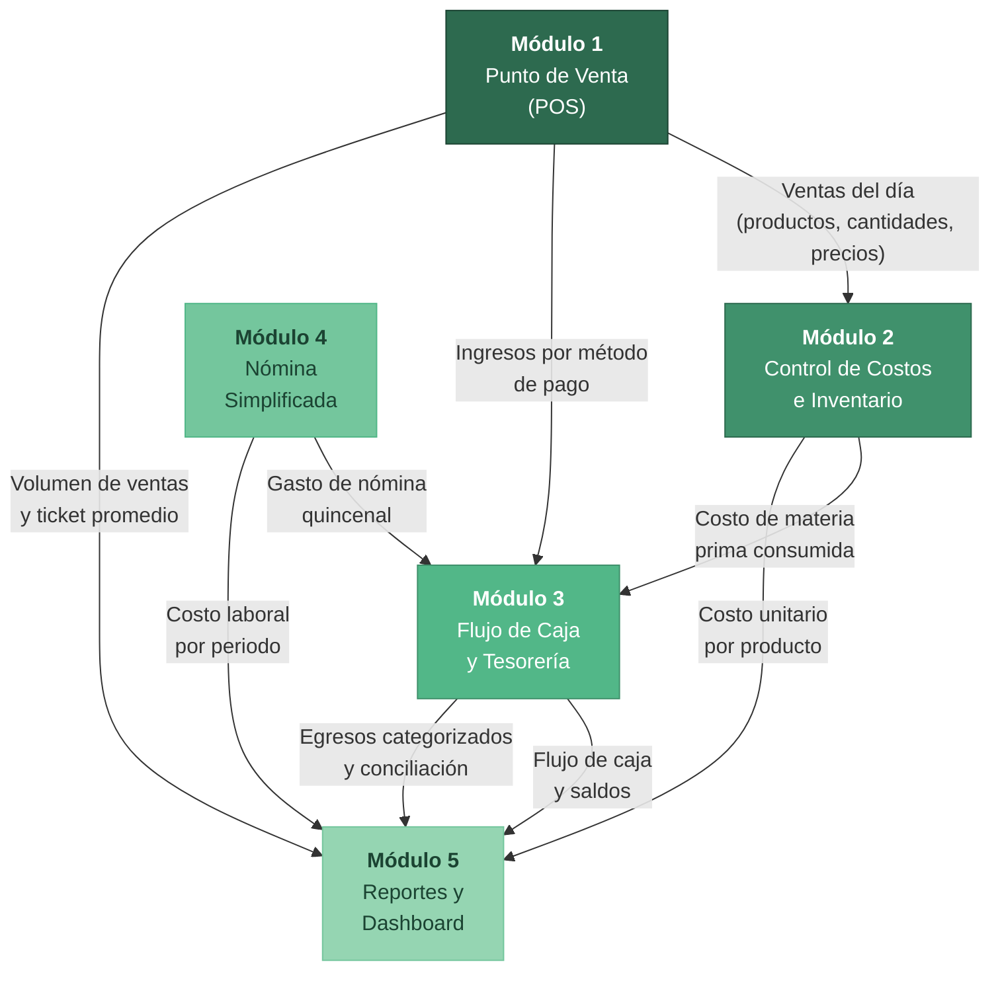
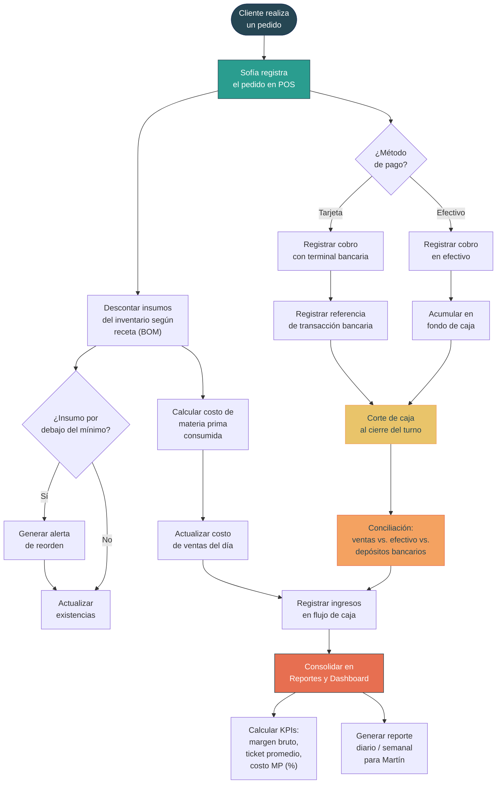
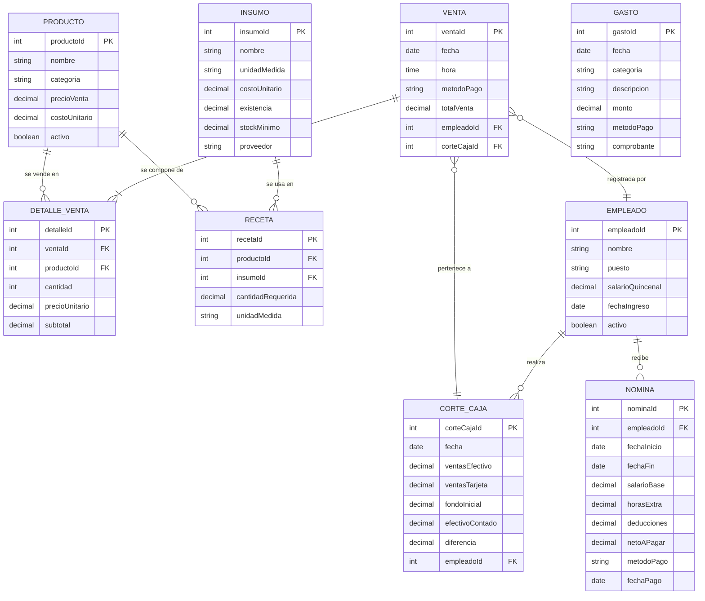

# Diseño conceptual del sistema de gestión financiera modular — Rústico Pizza y Pan

## 1. Justificación del sistema

El diagnóstico realizado a Rústico Pizza y Pan, mediante entrevista con los fundadores y análisis documental de los registros existentes, reveló un conjunto de deficiencias financieras y operativas que, si bien no comprometen la viabilidad inmediata del negocio, limitan su capacidad de crecimiento, control y toma de decisiones informadas. Cada problema identificado se vincula directamente con un módulo del sistema propuesto.

| # | Hallazgo del diagnóstico | Problema específico | Módulo que lo resuelve |
|:---:|---|---|---|
| H1 | Las ventas se registran de manera parcial en una hoja de Excel básica, sin desglose por producto, sin horario y sin vinculación al método de pago | No existe un registro de ventas estructurado que permita análisis de demanda, ticket promedio ni mezcla de productos | **Punto de Venta (POS)** |
| H2 | Los gastos se anotan en una libreta física sin categorización, sin distinción entre gastos personales y del negocio, y con anotaciones incompletas | No hay catálogo de cuentas ni separación entre gastos operativos, personales y de inversión; los registros son irrecuperables en caso de pérdida | **Flujo de Caja y Tesorería** |
| H3 | No existe cálculo formal del costo unitario de cada pizza ni de los productos de panadería; los precios se fijaron por intuición y comparación con competidores | Sin recetas costeadas (BOM), es imposible calcular margen bruto real, identificar productos rentables o detectar variaciones en costos de insumos | **Control de Costos e Inventario** |
| H4 | La terminal bancaria genera depósitos a la cuenta personal de Martín sin conciliación con las ventas del día; no se realiza corte de caja formal | No hay trazabilidad entre ventas registradas, cobros en terminal y depósitos bancarios; el flujo de caja real es desconocido | **Flujo de Caja y Tesorería** |
| H5 | Los pagos a Luis Ángel y Sofía se realizan en efectivo, sin recibo, sin registro fiscal y sin cálculo formal de prestaciones | El negocio incurre en riesgo fiscal y laboral; no hay visibilidad del costo real de la nómina como porcentaje de los ingresos | **Nómina Simplificada** |
| H6 | Martín y Mariana no disponen de reportes financieros periódicos; las decisiones de precio, compra y contratación se basan en percepción e intuición | Sin indicadores de desempeño (KPIs) ni reportes consolidados, no es posible evaluar la salud financiera del negocio ni planificar a mediano plazo | **Reportes y Dashboard** |
| H7 | No se lleva control de inventario de insumos; las compras se realizan cuando Martín percibe que un insumo se está agotando | No existe registro de existencias, consumo real ni merma; se desconoce la rotación de inventario y hay riesgo de desperdicio o desabasto | **Control de Costos e Inventario** |

La justificación del sistema se fundamenta en que los problemas identificados no son aislados, sino que forman un ciclo de opacidad financiera: sin registro de ventas no hay base para calcular costos, sin costos no hay margen conocido, sin margen no hay punto de equilibrio, y sin punto de equilibrio toda decisión estratégica es, esencialmente, una apuesta. El sistema propuesto busca romper este ciclo mediante la captura estructurada de datos en el punto de origen (la venta) y su propagación automática hacia los módulos de costos, tesorería, nómina y reportes.

---

## 2. Arquitectura del sistema

El sistema se estructura en cinco módulos interconectados que cubren el ciclo financiero completo de una microempresa del sector restaurantero. La arquitectura sigue un patrón de flujo descendente donde el Punto de Venta actúa como generador primario de datos y el módulo de Reportes como consumidor final.

**Principios de diseño:**

- **Modularidad:** Cada módulo puede implementarse de forma independiente, lo que permite una adopción gradual acorde a los recursos limitados de una microempresa.
- **Flujo unidireccional de datos:** Los datos se generan en el punto de venta y fluyen hacia los demás módulos sin duplicación, garantizando una fuente única de verdad.
- **Simplicidad operativa:** El sistema está diseñado para ser operado por personas sin formación contable ni tecnológica especializada, priorizando interfaces intuitivas y automatización de cálculos.
- **Escalabilidad:** La arquitectura modular permite incorporar funcionalidades adicionales (facturación electrónica, integración con plataformas de delivery, contabilidad fiscal) conforme el negocio crezca.

---

## 3. Diagrama de flujo de datos

El siguiente diagrama representa el recorrido completo de los datos desde que un cliente realiza un pedido hasta que la información se consolida en los reportes gerenciales. Se ilustra cómo un solo evento (una venta) genera actualizaciones en múltiples módulos del sistema.

**Narrativa del flujo:**

1. **Origen:** El flujo inicia cuando un cliente realiza un pedido (en mostrador, por teléfono o por WhatsApp). Sofía, encargada de caja, registra el pedido en el módulo POS.
2. **Bifurcación por método de pago:** El sistema registra si el pago fue en efectivo o con tarjeta. Los pagos en efectivo se acumulan en el fondo de caja; los pagos con tarjeta generan una referencia bancaria para conciliación posterior.
3. **Impacto en inventario:** Simultáneamente, el sistema descuenta los insumos correspondientes del inventario según la receta (lista de materiales o BOM) del producto vendido. Si algún insumo cae por debajo del nivel mínimo configurado, se genera una alerta de reorden.
4. **Cálculo de costo:** A partir de los insumos consumidos y sus costos unitarios registrados, el sistema calcula el costo de materia prima de cada venta y lo acumula en el costo de ventas del día.
5. **Conciliación:** Al cierre del turno, Sofía o Martín realizan el corte de caja. El sistema compara las ventas registradas con el efectivo contado y los vouchers de terminal, identificando discrepancias.
6. **Consolidación:** Todos los datos fluyen al módulo de Reportes, donde se calculan los KPIs y se generan los reportes periódicos para la toma de decisiones.

---

## 4. Modelo entidad-relación simplificado

El siguiente diagrama entidad-relación (ER) representa las principales entidades de datos del sistema y sus relaciones. Se trata de un modelo conceptual simplificado, no de un diseño de base de datos normalizado, cuyo objetivo es ilustrar qué información necesita capturar y relacionar el sistema.

**Descripción de las entidades:**

| Entidad | Descripción | Registros estimados |
|---|---|---|
| **Producto** | Cada artículo del menú: pizzas, panes, postres, bebidas. Incluye precio de venta y costo unitario calculado a partir de la receta | ~30 a 40 productos activos |
| **Venta** | Cada transacción individual con un cliente. Registra fecha, hora, método de pago y el empleado que la registró | ~30 a 60 ventas diarias |
| **DetalleVenta** | Líneas individuales de cada venta (qué producto, cuántas unidades, a qué precio). Permite saber exactamente qué se vendió | ~50 a 100 líneas diarias |
| **Insumo** | Cada materia prima utilizada en la elaboración: harina, queso mozzarella, pepperoni, tomate, levadura, etc. | ~50 a 80 insumos |
| **Receta (BOM)** | Lista de materiales por producto: qué insumos y en qué cantidad se necesitan para elaborar una unidad de cada producto. Es la pieza clave para el costeo | ~150 a 250 relaciones |
| **Gasto** | Cada erogación del negocio que no sea compra de insumos: renta, gas, luz, mantenimiento, publicidad, etc. | ~30 a 50 gastos mensuales |
| **CorteCaja** | Registro del cierre diario de caja: cuánto se vendió, cuánto se cobró en efectivo, cuánto con tarjeta y cuál es la diferencia | 1 por día operativo (~26/mes) |
| **Empleado** | Datos de cada miembro del equipo: Martín, Mariana, Luis Ángel, Sofía | 4 registros activos |
| **Nómina** | Registro de cada pago de nómina: salario base, deducciones, neto pagado, fecha y método de pago | ~8 registros mensuales (4 empleados x 2 quincenas) |

---

## 5. Descripción de módulos

### 5.1 Punto de Venta (POS)

**Objetivo:** Registrar de manera estructurada cada transacción de venta, capturando qué se vendió, cuánto se cobró y cómo se pagó, para generar la base de datos que alimenta al resto del sistema.

**Funcionalidades clave:**

- Registro de pedidos con selección de productos del catálogo, cantidades y modificaciones (por ejemplo, pizza grande en lugar de mediana, ingredientes extra).
- Cobro con soporte para efectivo y tarjeta bancaria, incluyendo cálculo automático de cambio y generación de ticket (impreso o digital).
- Registro del canal de venta: mostrador, teléfono o WhatsApp, para análisis de demanda por canal.
- Cierre de turno con generación automática de corte de caja y resumen de ventas por producto, por método de pago y por hora.
- Consulta rápida de ventas del día y comparativo con días anteriores.

**Datos de entrada:**

- Productos seleccionados por el cliente y sus cantidades.
- Método de pago (efectivo o tarjeta).
- Identificación del empleado que registra la venta (Sofía o Martín).

**Datos de salida:**

- Ticket de venta (para el cliente).
- Registro de venta y detalle de venta (hacia los módulos de Costos e Inventario, Tesorería y Reportes).
- Corte de caja diario (hacia Tesorería).
- Volumen de ventas por producto, hora y canal (hacia Reportes).

**Problema que resuelve (H1):** Actualmente, las ventas se registran parcialmente en una hoja de Excel sin desglose. El módulo POS captura cada venta con nivel de detalle suficiente para alimentar análisis de demanda, costeo y conciliación, reemplazando el registro manual incompleto por un flujo de datos estructurado.

---

### 5.2 Control de Costos e Inventario

**Objetivo:** Conocer el costo real de elaboración de cada producto del menú, controlar el consumo de insumos y mantener visibilidad sobre las existencias para evitar desabasto y desperdicio.

**Funcionalidades clave:**

- Registro de recetas (BOM — Bill of Materials) para cada producto del menú: qué insumos y en qué cantidad se requieren para producir una unidad. Por ejemplo: una pizza Pepperoni mediana requiere 250 g de masa, 150 g de queso mozzarella, 80 g de pepperoni, 100 ml de salsa de tomate.
- Cálculo automático del costo unitario de cada producto a partir de los costos de sus insumos, con actualización cada vez que se registre un nuevo precio de compra.
- Descuento automático de inventario conforme se registran ventas en el POS: cada venta de una pizza Pepperoni descuenta automáticamente los insumos correspondientes según la receta.
- Alertas de reorden cuando un insumo cae por debajo del nivel mínimo configurado (por ejemplo, si quedan menos de 2 kg de queso mozzarella).
- Registro de compras de insumos a proveedores, con fecha, proveedor, cantidad, costo unitario y costo total.

**Datos de entrada:**

- Recetas (BOM) de cada producto (configuración inicial).
- Ventas registradas en el POS (consumo automático).
- Compras de insumos a proveedores (reabastecimiento).
- Ajustes manuales de inventario (merma, desperdicio, autoconsumo).

**Datos de salida:**

- Costo unitario actualizado de cada producto (hacia Reportes y Tesorería).
- Estado de inventario en tiempo real (existencias, insumos críticos).
- Costo de materia prima consumida por periodo (hacia Tesorería y Reportes).
- Alertas de reorden (hacia el propietario).
- Reporte de variación de costos de insumos a lo largo del tiempo.

**Problemas que resuelve (H3, H7):** El negocio no cuenta con recetas costeadas ni control de inventario. Los precios se fijaron por intuición y las compras se realizan reactivamente. Este módulo permite conocer el margen bruto real de cada producto, identificar los más y menos rentables, y gestionar las compras de insumos de manera planificada.

---

### 5.3 Flujo de Caja y Tesorería

**Objetivo:** Registrar todos los ingresos y egresos del negocio de forma categorizada, conciliar los cobros con tarjeta contra los depósitos bancarios y proporcionar visibilidad en tiempo real sobre la posición de efectivo.

**Funcionalidades clave:**

- Registro de ingresos provenientes del POS, clasificados por método de pago (efectivo y tarjeta), con vinculación directa al corte de caja.
- Registro de egresos categorizados según un catálogo de cuentas simplificado: materia prima, renta, servicios (gas, luz, agua), nómina, mantenimiento, publicidad, impuestos, gastos personales del propietario (separados explícitamente del negocio).
- Conciliación bancaria: comparación de los vouchers de terminal con los depósitos efectivamente reflejados en la cuenta bancaria, identificando comisiones del procesador de pagos y retrasos.
- Separación formal entre cuentas personales y cuentas del negocio, con registro diferenciado de los retiros personales de Martín y Mariana.
- Proyección de flujo de caja a 30 días basada en el patrón histórico de ingresos y egresos recurrentes.

**Datos de entrada:**

- Cortes de caja diarios (desde el POS).
- Gastos registrados manualmente por Martín, categorizados según catálogo de cuentas.
- Pagos de nómina (desde el módulo de Nómina).
- Compras de insumos (desde el módulo de Costos e Inventario).
- Movimientos bancarios (ingreso manual o importación de estado de cuenta).

**Datos de salida:**

- Estado de flujo de caja diario, semanal y mensual.
- Reporte de conciliación bancaria (ventas con tarjeta vs. depósitos).
- Categorización de egresos por rubro.
- Proyección de flujo de caja a 30 días.
- Alertas de saldo mínimo en caja.

**Problemas que resuelve (H2, H4):** La libreta de gastos no categoriza ni distingue entre gastos personales y del negocio; la terminal bancaria no se concilia con las ventas. Este módulo establece un catálogo de cuentas, obliga a la categorización de cada egreso, separa las finanzas personales de las del negocio y genera la conciliación automática entre ventas, cobros y depósitos.

---

### 5.4 Nómina Simplificada

**Objetivo:** Formalizar el registro de los pagos al personal, calcular el costo laboral real del negocio y generar recibos que protejan tanto al empleador como a los empleados.

**Funcionalidades clave:**

- Registro del salario quincenal de cada empleado (Luis Ángel y Sofía como empleados, Martín y Mariana como propietarios con asignación de sueldo administrativo).
- Cálculo de costo laboral total por quincena: salario base más las provisiones que eventualmente deberán cubrirse al formalizar la relación laboral (aguinaldo, vacaciones, prima vacacional).
- Generación de recibos de nómina simplificados que documenten cada pago realizado: nombre del empleado, periodo, monto, método de pago y firma de recibido.
- Registro del método de pago (efectivo o transferencia) y fecha real de pago.
- Cálculo del costo laboral como porcentaje de las ventas, por periodo, para evaluar la eficiencia operativa.

**Datos de entrada:**

- Datos del empleado (nombre, puesto, fecha de ingreso, salario pactado).
- Periodo de nómina (quincenal).
- Ajustes: horas extra, faltas, deducciones pactadas.

**Datos de salida:**

- Recibo de nómina por empleado y por periodo.
- Monto total de nómina por quincena y por mes (hacia Tesorería).
- Costo laboral como porcentaje de ventas (hacia Reportes).
- Historial de pagos por empleado.

**Problema que resuelve (H5):** Los pagos a Luis Ángel y Sofía se hacen en efectivo sin recibo ni registro fiscal. No hay visibilidad del costo laboral real. Este módulo formaliza el proceso de pago, genera evidencia documental y permite al propietario conocer el peso de la nómina en la estructura de costos.

---

### 5.5 Reportes y Dashboard

**Objetivo:** Consolidar la información generada por todos los módulos en indicadores clave de desempeño (KPIs) y reportes visuales que permitan a Martín y Mariana tomar decisiones informadas sobre precios, compras, contrataciones y estrategia.

**Funcionalidades clave:**

- Dashboard visual con los KPIs principales del negocio actualizados diariamente: ventas del día, margen bruto, ticket promedio, posición de caja.
- Reporte de ventas por producto, por día de la semana y por hora, para identificar patrones de demanda (por ejemplo, qué pizza se vende más los viernes, a qué hora se concentra la demanda).
- Reporte de rentabilidad por producto: comparación del precio de venta contra el costo de materia prima para cada artículo del menú, ordenado por margen de contribución.
- Estado de resultados mensual simplificado: ingresos menos costo de ventas menos gastos operativos, con visualización del margen neto.
- Comparativo histórico: desempeño del mes actual contra los meses anteriores, con identificación de tendencias.

**Datos de entrada:**

- Datos consolidados de los cuatro módulos anteriores: ventas (POS), costos (Inventario), flujos (Tesorería), nómina (Nómina).

**Datos de salida:**

- Dashboard interactivo con KPIs en tiempo real.
- Reportes PDF descargables para revisión semanal y mensual.
- Alertas automáticas cuando un KPI sale del rango esperado (por ejemplo, si el costo de materia prima supera el 35% de las ventas).
- Datos tabulados exportables para análisis adicional en Excel.

**Problema que resuelve (H6):** No existen reportes financieros; todas las decisiones se basan en percepción. Este módulo transforma los datos crudos en información accionable, permitiendo que Martín y Mariana evalúen la salud financiera del negocio con evidencia, no con intuición.

---

## 6. KPIs propuestos

Los indicadores clave de desempeño (KPIs) propuestos están diseñados para una microempresa del sector restaurantero. Se priorizan métricas que sean comprensibles para un propietario sin formación contable, calculables con los datos que genera el sistema y accionables en el corto plazo.

| KPI | Fórmula | Frecuencia de medición | Meta sugerida | Justificación |
|---|---|:---:|:---:|---|
| **Margen bruto (%)** | (Ventas − Costo de materia prima) ÷ Ventas × 100 | Diaria / Semanal | ≥ 65% | En el sector pizzero artesanal, el costo de materia prima no debería superar el 30-35% de las ventas. Un margen bruto del 65% o superior indica una estructura de costos saludable |
| **Ticket promedio ($)** | Ventas totales del periodo ÷ Número de transacciones | Diaria | $250 – $400 MXN | Basado en el perfil de consumo identificado en el diagnóstico: una pizza + bebida + postre. Permite evaluar estrategias de venta sugestiva |
| **Costo de materia prima (%)** | Costo total de insumos consumidos ÷ Ventas totales × 100 | Semanal | ≤ 30 – 35% | Indicador complementario al margen bruto. Si supera el 35%, deben revisarse recetas, porciones, precios de compra o desperdicio |
| **Rotación de inventario** | Costo de insumos consumidos en el periodo ÷ Inventario promedio del periodo | Mensual | 8 – 12 veces/mes | Para un negocio con insumos perecederos (quesos, verduras, masa fresca), una rotación alta indica frescura y bajo desperdicio. Rotación baja sugiere sobrecompra o merma |
| **Punto de equilibrio ($)** | Costos fijos mensuales ÷ (1 − (Costo variable unitario promedio ÷ Precio de venta unitario promedio)) | Mensual | ≤ $60,000 MXN | Representa el nivel de ventas mínimo para cubrir todos los costos. Debe compararse contra las ventas reales ($80,000 – $120,000) para evaluar el colchón de seguridad |
| **Productividad por empleado** | Ventas totales del periodo ÷ Número de empleados | Mensual | ≥ $20,000 MXN/empleado | Con 4 empleados y ventas de $80,000 – $120,000, el rango esperado es $20,000 – $30,000 por empleado. Permite evaluar si el equipo actual es suficiente o si se justifica una contratación adicional |
| **Diferencia en corte de caja (%)** | (Efectivo contado − Efectivo esperado según ventas) ÷ Efectivo esperado × 100 | Diaria | ≤ ±1% | Mide la precisión del manejo de efectivo. Diferencias recurrentes superiores al 1% requieren investigación (errores de cobro, faltantes, registros omitidos) |
| **Porcentaje de ventas con tarjeta** | Ventas cobradas con tarjeta ÷ Ventas totales × 100 | Semanal | Monitoreo | No tiene meta fija, pero es crítico para la conciliación bancaria y para anticipar las comisiones del procesador de pagos (usualmente 2.5% – 3.6% por transacción) |

**Nota sobre las metas:** Los valores sugeridos son estimaciones iniciales basadas en los estándares del sector restaurantero mexicano y en la información del diagnóstico. Deben calibrarse durante los primeros tres meses de operación del sistema con datos reales de Rústico.

---

## 7. Consideraciones de implementación

### 7.1 Enfoque de implementación por fases

Dada la naturaleza del negocio (microempresa con 4 empleados, sin personal de TI, sin experiencia previa en sistemas de gestión), se propone una implementación gradual en cuatro fases que minimice la disrupción operativa y permita la adopción progresiva.

| Fase | Módulos | Duración estimada | Objetivo |
|:---:|---|:---:|---|
| **1** | Punto de Venta (POS) + Corte de Caja | 4 semanas | Capturar el dato de origen: cada venta con desglose de producto y método de pago. Establecer la disciplina del corte de caja diario |
| **2** | Flujo de Caja y Tesorería | 3 semanas | Categorizar egresos, separar finanzas personales del negocio, iniciar la conciliación bancaria |
| **3** | Control de Costos e Inventario | 4 semanas | Registrar recetas (BOM), calcular costos unitarios, establecer control de existencias de los 15-20 insumos principales |
| **4** | Nómina Simplificada + Reportes y Dashboard | 3 semanas | Formalizar los pagos al personal, activar los KPIs y los reportes consolidados |

**Duración total estimada:** 14 semanas (aproximadamente 3.5 meses).

### 7.2 Sugerencias tecnológicas de contexto

Las siguientes sugerencias se presentan exclusivamente como referencia contextual para situar el diseño conceptual dentro de un ecosistema tecnológico realista. No constituyen una recomendación de implementación.

| Componente | Opciones de contexto | Justificación |
|---|---|---|
| **POS** | Software especializado para restaurantes (por ejemplo, Poster POS, Square, iFood) o una solución basada en hojas de cálculo avanzadas (Google Sheets con formularios) | El volumen de transacciones (~30-60 diarias) es manejable tanto por un POS comercial de bajo costo como por una hoja de cálculo bien estructurada |
| **Inventario y costos** | Módulo integrado del POS o una hoja de cálculo con fórmulas de BOM | Los ~50-80 insumos y ~30-40 productos no justifican un ERP; una solución ligera es suficiente |
| **Tesorería** | Hoja de cálculo con catálogo de cuentas predefinido y plantilla de conciliación bancaria | La complejidad de los flujos es baja; lo crítico es la disciplina de registro, no la sofisticación del software |
| **Nómina** | Hoja de cálculo con plantilla quincenal y generador de recibos en PDF | Con 4 empleados, la nómina no requiere software especializado |
| **Reportes** | Dashboard en Google Sheets, Looker Studio (Data Studio) o Excel con tablas dinámicas | Las herramientas gratuitas de Google son suficientes para el volumen de datos y permiten acceso remoto desde cualquier dispositivo |

### 7.3 Necesidades de capacitación

| Persona | Capacitación requerida | Prioridad |
|---|---|:---:|
| **Martín** (propietario) | Lectura e interpretación de reportes y KPIs; registro de gastos categorizados; conciliación bancaria básica; registro de compras de insumos | Alta |
| **Mariana** (cofundadora) | Registro de producción de panadería; consulta de inventario de insumos de repostería | Media |
| **Sofía** (caja) | Operación del módulo POS: registro de pedidos, cobro, cierre de turno y corte de caja | Alta |
| **Luis Ángel** (ayudante) | Registro de recepción de insumos cuando Martín no está presente | Baja |

### 7.4 Factores críticos de éxito

1. **Compromiso del propietario:** Martín debe adoptar la disciplina de registrar cada gasto y revisar los reportes semanalmente. Sin este compromiso, el sistema genera datos pero no genera valor.
2. **Simplicidad por encima de completitud:** Es preferible un sistema que registre el 90% de las transacciones de forma consistente que uno que pretenda capturar el 100% pero se abandone por complejidad.
3. **Migración gradual:** No eliminar la libreta de gastos ni el Excel actual durante las primeras 4 semanas; mantener un periodo de registro paralelo para validar la integridad de los datos del nuevo sistema.
4. **Revisión y ajuste:** Al término de cada fase, realizar una sesión de revisión para ajustar categorizaciones, recetas, niveles mínimos de inventario y metas de KPIs con base en los datos reales capturados.
5. **Separación de cuentas bancarias:** Como prerrequisito no tecnológico, se recomienda enfáticamente que Martín abra una cuenta bancaria exclusiva para el negocio, para que la conciliación bancaria sea viable y el flujo de caja refleje únicamente la operación de Rústico.
