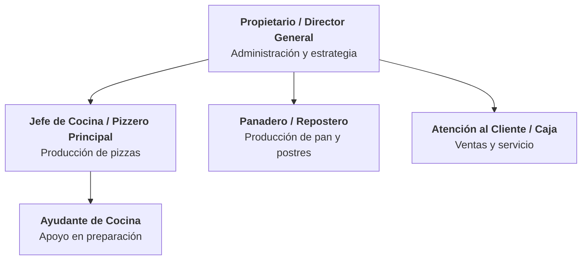

# Rústico Pizza y Pan

## 2.1 Origen

Rústico Pizza y Pan nació en Morelia, Michoacán, como un proyecto familiar impulsado por la pasión de crear pizza artesanal de masa delgada y pan de elaboración tradicional. Fundada en 2019, la pizzería abrió sus puertas en la colonia Félix Ireta, sobre la calle Vicente Santa María 1491-A, en un local compacto diseñado principalmente para servicio de mostrador y para llevar.

La idea del negocio surgió de la observación de un nicho desatendido en la zona: la escasez de opciones de pizza artesanal de alta calidad fuera del centro histórico de Morelia. Los fundadores, con formación autodidacta en panadería y cocina italiana, decidieron combinar dos oficios complementarios —pizzería y panadería— bajo un mismo concepto. Esta fusión se refleja en el nombre: *Rústico* evoca lo artesanal, lo hecho a mano, lo auténtico; *Pizza y Pan* comunica de manera directa la doble oferta del negocio.

Desde su apertura, Rústico ha mantenido un enfoque de crecimiento orgánico, priorizando la calidad del producto y la atención personalizada sobre la expansión acelerada. A lo largo de los años ha construido una base de clientes leales, alcanzando una calificación de **4.9 sobre 5** con más de 109 reseñas en Google, lo que lo posiciona como uno de los negocios de pizza mejor valorados en Morelia.

---

## 2.2 Sector económico

### Clasificación sectorial

Rústico Pizza y Pan se ubica en el **sector terciario** (servicios) de la economía, específicamente en la industria de preparación y venta de alimentos. De acuerdo con el Sistema de Clasificación Industrial de América del Norte (SCIAN), el negocio se clasifica en las siguientes categorías:

| Código SCIAN | Descripción |
|:---:|---|
| 722 | Servicios de preparación de alimentos y bebidas |
| 7225 | Restaurantes de autoservicio y de comida para llevar |
| 311812 | Panificación industrial y artesanal (actividad complementaria) |

### Contexto de la industria en México

La industria restaurantera en México representa aproximadamente el **15.3% del PIB turístico** y el **1.8% del PIB nacional**. El segmento de pizzerías ha mantenido un crecimiento sostenido, impulsado por la preferencia del consumidor mexicano hacia la pizza como una de las opciones de comida rápida y casual más populares.

En Michoacán, el sector de alimentos y bebidas presenta las siguientes características relevantes:

- **Alta fragmentación:** Predominan las micro y pequeñas empresas familiares.
- **Crecimiento del segmento artesanal:** Existe una tendencia creciente hacia productos diferenciados y de preparación artesanal, particularmente en ciudades universitarias como Morelia.
- **Estacionalidad moderada:** El consumo presenta picos durante fines de semana, periodos vacacionales y temporadas festivas (Día de Muertos, fiestas decembrinas).

### Clasificación por tamaño

Conforme a los criterios de la Secretaría de Economía de México, Rústico se clasifica como **microempresa** del sector servicios, con menos de 10 empleados y ventas anuales estimadas por debajo de los 4 millones de pesos.

---

## 2.3 Productos y servicios

### Propuesta de valor

Rústico Pizza y Pan se diferencia en el mercado moreliano al ofrecer **pizza artesanal de masa delgada** combinada con **panadería y repostería de elaboración propia**, todo bajo un concepto rústico y casero. La preparación se realiza con ingredientes frescos y recetas propias, sin recurrir a masas congeladas ni productos industrializados.

### Catálogo de productos

#### Pizzas

Producto estrella del negocio. Se elaboran con masa delgada preparada diariamente y se hornean al momento del pedido.

| Producto | Descripción | Precio aprox. (MXN) |
|---|---|:---:|
| Pizza mediana | Base de masa delgada, variedad de sabores (pepperoni, hawaiana, mexicana, 4 quesos, vegetariana, entre otras) | ~$200 |
| Pizza grande | Mismas opciones de sabor en formato grande | ~$280 |
| Pizza especialidad | Combinaciones de temporada o recetas exclusivas de la casa | Variable |

#### Panadería y repostería

Oferta complementaria que distingue a Rústico de las pizzerías convencionales.

| Producto | Descripción | Disponibilidad |
|---|---|:---:|
| Tiramisú | Postre italiano clásico, preparación artesanal | Permanente |
| Roles (rollos de canela) | Rollos glaseados de preparación artesanal | Permanente |
| Galletas | Variedad de galletas horneadas en el local | Permanente |
| Pan de muerto | Pan tradicional mexicano de temporada | Octubre–Noviembre |
| Repostería variada | Pasteles y postres según disponibilidad | Rotativa |

#### Bebidas

| Producto | Descripción |
|---|---|
| Café | Bebidas de café preparadas en el establecimiento |
| Refrescos | Bebidas embotelladas complementarias |

### Servicios

| Servicio | Descripción |
|---|---|
| Venta en mostrador | Modelo principal de atención; pedidos para llevar |
| Consumo en local | Espacio compacto con lugares limitados para consumo in situ |
| Pedidos por redes sociales | Pedidos y consultas a través de Facebook e Instagram |
| Productos de temporada | Elaboración de productos especiales en fechas clave (pan de muerto, roscas, etc.) |

### Horario de operación

| Día | Horario |
|:---:|:---:|
| Domingo | 2:00 PM – 9:30 PM |
| Lunes | 2:00 PM – 9:30 PM |
| Martes | **Cerrado** |
| Miércoles | 2:00 PM – 9:30 PM |
| Jueves | 2:00 PM – 9:30 PM |
| Viernes | 2:00 PM – 9:30 PM |
| Sábado | 2:00 PM – 9:30 PM |

---

## 2.4 Estructura organizacional

### Tipo de estructura

Rústico Pizza y Pan opera con una **estructura organizacional simple (lineal)**, característica de las microempresas familiares. La toma de decisiones es centralizada en los fundadores, y la comunicación interna es directa e informal. Esta estructura permite agilidad operativa y control de calidad directo, aunque puede limitar la escalabilidad.

### Organigrama

### Descripción de puestos

| Puesto | Funciones principales | Perfil |
|---|---|---|
| **Propietario / Director General** | Administración general, compras, finanzas, estrategia comercial, gestión de redes sociales, relación con proveedores | Fundador del negocio. Conocimiento integral de todas las áreas operativas |
| **Jefe de Cocina / Pizzero Principal** | Preparación de masas, elaboración de pizzas, control de calidad de ingredientes, diseño de recetas | Experiencia en cocina italiana y manejo de horno. Conocimiento de técnicas de masa delgada |
| **Panadero / Repostero** | Elaboración de pan, roles, galletas, tiramisú y productos de temporada | Formación en panadería y repostería. Manejo de tiempos de fermentación y horneado |
| **Ayudante de Cocina** | Preparación de ingredientes (corte, porcionado), limpieza, apoyo en armado de pizzas | Puesto de apoyo operativo. Capacitación interna |
| **Atención al Cliente / Caja** | Toma de pedidos, cobro, empaque, atención en mostrador y redes sociales | Habilidades de comunicación y servicio al cliente. Manejo de terminal de cobro |

> **Nota:** En una microempresa de esta naturaleza, es común que una misma persona desempeñe múltiples roles. El propietario frecuentemente participa en la operación directa (cocina, atención al cliente), y los puestos pueden ser cubiertos por miembros de la familia.

---

## 2.5 Mercados que atiende

### Segmentación geográfica

| Variable | Descripción |
|---|---|
| **País** | México |
| **Estado** | Michoacán de Ocampo |
| **Ciudad** | Morelia (capital del estado, ~850,000 habitantes) |
| **Zona de influencia primaria** | Colonias Félix Ireta, Ventura Puente, Chapultepec y zonas aledañas al sur-poniente de Morelia |
| **Radio de cobertura** | Aproximadamente 3–5 km alrededor del establecimiento |

### Segmentación demográfica

| Variable | Segmento principal |
|---|---|
| **Edad** | 18–45 años |
| **Género** | Indistinto |
| **Nivel socioeconómico** | C y C+ (clase media y media-alta) |
| **Ocupación** | Estudiantes universitarios, profesionistas jóvenes, familias jóvenes |
| **Ingreso mensual estimado** | $8,000–$25,000 MXN |

### Segmentación psicográfica

| Variable | Características |
|---|---|
| **Estilo de vida** | Valoran la calidad sobre la cantidad; buscan experiencias gastronómicas auténticas por encima de la conveniencia de cadenas |
| **Valores** | Aprecio por lo artesanal, lo local, lo hecho a mano; apoyo al comercio de barrio |
| **Comportamiento de compra** | Compras recurrentes (clientes habituales); sensibles a recomendaciones boca a boca y reseñas en línea |
| **Motivación** | Sabor diferenciado, frescura del producto, ambiente familiar |

### Segmentación conductual

| Variable | Descripción |
|---|---|
| **Frecuencia de compra** | 1–3 veces por mes (clientes regulares) |
| **Ocasión de consumo** | Cenas familiares, reuniones casuales, antojo de fin de semana |
| **Canal de descubrimiento** | Redes sociales (Facebook e Instagram), reseñas de Google, recomendación directa |
| **Lealtad** | Alta — evidenciada por la calificación de 4.9/5 y el volumen de reseñas positivas |

### Mercados secundarios

- **Turistas y visitantes:** Morelia recibe turismo nacional, especialmente durante el Festival de Música, Día de Muertos y periodos vacacionales. El perfil de Google del negocio actúa como canal de captación para este segmento.
- **Clientes de temporada:** Compradores de productos específicos como pan de muerto (octubre-noviembre) o roscas de reyes (enero), que pueden no ser clientes regulares de pizza.

---

## 2.6 Principales competidores

### Mapa competitivo

Rústico Pizza y Pan compite en dos frentes: como **pizzería artesanal** y como **panadería/repostería**. Esto le otorga un posicionamiento dual poco común en Morelia, pero también lo expone a competidores de ambas industrias.

### Competidores directos (pizzerías artesanales)

| Competidor | Ubicación | Concepto | Precio por persona (MXN) | Diferenciador |
|---|---|---|:---:|---|
| **Mammut Pizza — Rústica Napolitana** | Av. Madero Oriente 1044, Centro Histórico | Pizza napolitana artesanal, tamaño único (34 cm) | $100–$200 | Técnica napolitana auténtica; ubicación premium frente al Acueducto |
| **La Buca** | Antonio Alzate 922, Centro Histórico | Pizza artesanal en horno de leña; concepto speakeasy | $150–$250 | Experiencia inmersiva (entrada oculta, fachada con enredaderas); coctelería artesanal |
| **De Leña** | 3 sucursales (Chapultepec Norte, Villa Universidad, Plaza Las Américas) | Pizza de masa delgada en horno de leña; menú italiano completo | $200–$300 | Marca más establecida con múltiples ubicaciones; menú amplio (pastas, ensaladas) |
| **Mi Lola (Cocina de la Abuela)** | Av. Camelinas 2308, Bosque Camelinas | Restaurante con pizza artesanal, pastas y cortes; ambiente familiar | $150–$250 | Concepto amplio (no solo pizza); música en vivo; presencia en apps de delivery |

### Competidores indirectos — Cadenas de pizza

| Competidor | Presencia en Morelia | Precio por pizza (MXN) | Modelo competitivo |
|---|---|:---:|---|
| **Domino's Pizza** | 5+ sucursales | $80–$200 | Velocidad de entrega, promociones agresivas, cobertura amplia |
| **Little Caesars** | 3+ sucursales | $99–$179 | Modelo "Hot-N-Ready" (listo para llevar), precio bajo |
| **Pizza Hut** | 1 sucursal (Plaza San Miguel) | $120–$250 | Experiencia de restaurante de cadena; buffet |

### Competidores indirectos — Panaderías y reposterías artesanales

| Competidor | Ubicación | Concepto | Nivel de amenaza |
|---|---|---|:---:|
| **Panoli (Panadería y Deli)** | Morelia (servicio a domicilio) | Pan artesanal, repostería, charcutería y productos gourmet | Alto |
| **Horno los Ortiz** | Vicente Santa María 1077, Col. Ventura Puente | Panadería tradicional con 29 años de tradición; pan de muerto, roles | Medio |
| **Geronte 91 / Panadería Artesanal 91** | Av. Morelos Sur 452 | Pan de masa madre, café de especialidad, talleres | Medio-Alto |
| **The Loaf Factory** | Morelia (solo entregas semanales) | Pan de masa madre 100% artesanal; modelo bajo pedido | Medio |

### Análisis comparativo — Posición competitiva de Rústico

| Factor competitivo | Rústico | Pizzerías artesanales | Cadenas | Panaderías |
|---|:---:|:---:|:---:|:---:|
| Calidad de pizza | ★★★★★ | ★★★★☆ – ★★★★★ | ★★☆☆☆ | N/A |
| Variedad de panadería | ★★★★☆ | ★☆☆☆☆ | ★☆☆☆☆ | ★★★★★ |
| Precio accesible | ★★★★☆ | ★★★☆☆ | ★★★★★ | ★★★☆☆ |
| Ubicación / accesibilidad | ★★★☆☆ | ★★★★☆ | ★★★★★ | ★★★☆☆ |
| Presencia digital | ★★★☆☆ | ★★★★☆ | ★★★★★ | ★★★☆☆ |
| Experiencia en local | ★★☆☆☆ | ★★★★★ | ★★★☆☆ | ★★★☆☆ |
| Reputación (reseñas) | ★★★★★ | ★★★★☆ | ★★★☆☆ | ★★★★☆ |

### Ventaja competitiva de Rústico

La principal ventaja competitiva de Rústico Pizza y Pan es su **posicionamiento dual como pizzería y panadería artesanal**, una combinación poco frecuente en el mercado moreliano. Mientras que las pizzerías artesanales se enfocan exclusivamente en pizza y las panaderías en pan, Rústico ofrece ambos bajo un mismo techo, lo que:

1. **Amplía las ocasiones de compra** — Un cliente puede ir por pizza y llevarse pan, o viceversa.
2. **Incrementa el ticket promedio** — La oferta complementaria de postres y pan incentiva compras adicionales.
3. **Genera diferenciación genuina** — Ningún competidor directo en Morelia replica exactamente este modelo.
4. **Fortalece la lealtad** — La calificación de 4.9/5 evidencia una base de clientes altamente satisfechos.

El principal reto competitivo es la **limitación del espacio físico** y la **ubicación fuera del centro histórico**, lo que reduce la visibilidad frente a competidores con locales en zonas de alto tránsito peatonal. Para contrarrestar esto, el negocio se apoya en su reputación en línea y el marketing orgánico a través de redes sociales.
