# Rústico Pizza y Pan

## 2.1 Origen

### Historia y fundación

Rústico Pizza y Pan nació en Morelia, Michoacán, a finales de 2019, como un emprendimiento familiar motivado por una convicción sencilla: que la pizza artesanal y el buen pan no deberían ser exclusivos del centro de la ciudad. Sus fundadores, una pareja joven moreliana con raíces en la tradición panadera michoacana, habían acumulado años de experimentación casera con masas, fermentaciones y técnicas de horneado antes de atreverse a dar el salto al negocio propio.

La idea comenzó a gestarse en 2017, cuando los fundadores empezaron a vender pizzas de masa delgada entre amigos y familiares los fines de semana, utilizando un pequeño horno casero. La respuesta fue inmediata: la calidad de la masa —crujiente, delgada, con el sabor característico de una fermentación lenta— generó una demanda que rápidamente superó la capacidad de producción informal. Motivados por este éxito orgánico, decidieron formalizar el proyecto y buscar un local propio.

La ubicación elegida fue la calle Vicente Santa María 1491-A, en la colonia Félix Ireta, una zona residencial del sur-poniente de Morelia con alta densidad de familias jóvenes y estudiantes universitarios, pero con escasas opciones gastronómicas artesanales. El local, compacto por diseño —apenas un mostrador, una barra y espacio para un par de sillas—, fue concebido desde el inicio como un punto de venta enfocado en el servicio para llevar, lo que permitió reducir costos de operación y concentrar la inversión en equipamiento de cocina: un horno de leña artesanal, amasadoras profesionales y vitrinas refrigeradas para la exhibición de pan y postres.

### El concepto: la fusión de pizzería y panadería

El nombre *Rústico* fue elegido deliberadamente para evocar lo artesanal, lo hecho a mano, lo que se elabora sin prisas y con ingredientes reales. El subtítulo *Pizza y Pan* comunica de forma directa la doble vocación del negocio, una combinación inusual en el mercado moreliano que se convertiría en su principal diferenciador. Mientras que las pizzerías de la ciudad se especializan exclusivamente en pizza, y las panaderías en pan, Rústico decidió habitar ambos mundos: el de la cocina italiana artesanal y el de la panadería tradicional mexicana con toques contemporáneos.

Esta fusión no fue accidental. Los fundadores entendieron que la preparación de masa para pizza y la elaboración de pan comparten principios fundamentales —fermentación, manejo de temperatura, tiempos de reposo— y que dominar ambos oficios bajo el mismo techo no solo era viable, sino que generaba sinergias operativas: los mismos hornos, las mismas materias primas base (harinas de alta calidad, levaduras, agua), y la misma filosofía de frescura diaria.

### Crecimiento y consolidación

Los primeros meses de operación coincidieron con el inicio de la pandemia de COVID-19 a principios de 2020, un periodo que paradójicamente favoreció al modelo de negocio de Rústico. Mientras que restaurantes con servicio de comedor sufrieron cierres temporales y caídas drásticas en ventas, Rústico —diseñado desde su origen para el servicio para llevar— continuó operando con normalidad, adaptándose con pedidos por WhatsApp y redes sociales. La pandemia aceleró la adopción del comercio digital y el hábito de consumir alimentos de calidad en casa, tendencias que beneficiaron directamente al negocio.

Entre 2021 y 2023, Rústico consolidó su base de clientes mediante un crecimiento estrictamente orgánico: sin publicidad pagada significativa, sin presencia en plataformas de delivery masivas como Uber Eats o Rappi, y sin franquicias ni sucursales. El boca a boca, las reseñas en Google y la presencia en redes sociales (Facebook e Instagram) fueron los únicos motores de crecimiento. Para 2025, el negocio acumula una calificación de **4.9 sobre 5** con más de **159 reseñas** en Google, posicionándose como una de las pizzerías mejor valoradas de Morelia.

El perfil de reseñas refleja una lealtad poco común: de las reseñas registradas, más del **92% son de cinco estrellas**, con comentarios recurrentes que destacan la calidad de la masa, la frescura de los ingredientes, el sabor del tiramisú y la atención cercana de los propietarios, quienes siguen participando activamente en la operación diaria del negocio.

> **Referencias — Sección 2.1:**
> - Google Maps — Perfil de negocio de Rústico Pizza y Pan. Disponible en: [google.com/maps](https://maps.google.com) (búsqueda: "Rústico Pizza y Pan Morelia").
> - Wanderlog (2025). *Rústico Pizza y Pan — Reviews & Photos.* Disponible en: [wanderlog.com/place/details/16529462](https://wanderlog.com/place/details/16529462/r%C3%BAstico-pizza-y-pan)
> - Restaurant Guru (2025). *Rústico Pizza y Pan, Morelia.* Disponible en: [restaurantguru.com/Rustico-Pizza-y-Pan-Morelia](https://restaurantguru.com/Rustico-Pizza-y-Pan-Morelia)
> - Carta.menu (2025). *Rústico Pizza Y Pan.* Disponible en: [carta.menu/restaurants/morelia-1/rustico-pizza-y-pan](https://carta.menu/restaurants/morelia-1/rustico-pizza-y-pan)
> - Facebook — Rústico Pizza y Pan Morelia. Disponible en: [facebook.com/Rusticopizzaypanmorelia](https://facebook.com/Rusticopizzaypanmorelia)

---

## 2.2 Sector económico

### Clasificación sectorial

Rústico Pizza y Pan se ubica en el **sector terciario** (servicios) de la economía mexicana, específicamente en la rama de preparación y venta de alimentos. De acuerdo con el Sistema de Clasificación Industrial de América del Norte (SCIAN 2023), el negocio se clasifica en las siguientes categorías:

| Código SCIAN | Descripción | Relación con Rústico |
|:---:|---|---|
| 722 | Servicios de preparación de alimentos y bebidas | Sector general |
| 722517 | Restaurantes con servicio de preparación de pizzas, hamburguesas, hot dogs y pollos rostizados para llevar | **Actividad principal** — preparación y venta de pizza para llevar |
| 311812 | Panificación industrial y artesanal | Actividad complementaria — elaboración de pan, roles, galletas y repostería |

El código **722517** es el más preciso para la actividad principal de Rústico, ya que describe específicamente los establecimientos dedicados a la preparación de pizza con servicio predominante para llevar, que es el modelo operativo central del negocio.

### La industria restaurantera en México: panorama general

La industria restaurantera mexicana es una de las más dinámicas del país y constituye un pilar fundamental de la economía nacional. De acuerdo con datos del Instituto Nacional de Estadística y Geografía (INEGI) y la Cámara Nacional de la Industria Restaurantera y Alimentos Condimentados (CANIRAC), el sector presenta las siguientes dimensiones:

| Indicador | Valor | Fuente |
|---|---|---|
| Unidades económicas registradas (servicios de alimentos y bebidas) | 736,367 | DENUE-INEGI, 2025 |
| Participación en el total de negocios del país | 12.2% | INEGI, 2024 |
| Empleos directos generados | Más de 2 millones | CANIRAC, 2024 |
| Distribución por género del empleo | 55.8% mujeres, 44.2% hombres | INEGI, 2024 |
| Microempresas (0–10 empleados) como porcentaje del total | 96% | DENUE-INEGI, 2025 |
| PIB del sector (alojamiento temporal y alimentos, T3 2025) | $838,500 millones MXN | INEGI, Cuentas Nacionales |
| Crecimiento real del sector en 2024 | 4.5% | CANIRAC, 2024 |
| Proyección de crecimiento para 2025 | 5.5%–6.0% | CANIRAC, 2025 |
| Nuevos restaurantes incorporados en 2024 | ~80,000 | CANIRAC, 2024 |

La composición del sector por tipo de establecimiento revela la diversidad gastronómica mexicana:

| Tipo de establecimiento | Participación nacional |
|---|:---:|
| Preparación de antojitos | 21.6% |
| Taquerías y torterías | 21.1% |
| Cafeterías y establecimientos de bebidas | 12.0% |
| Pizzerías, hamburgueserías y similares (SCIAN 722517) | ~8% |
| Otros (marisquerías, comida internacional, etc.) | 37.3% |

### Distribución de establecimientos por tamaño

La abrumadora mayoría de los negocios de alimentos en México son microempresas, lo que refleja la naturaleza fragmentada y emprendedora del sector:

| Tamaño | Número de unidades | Porcentaje |
|---|:---:|:---:|
| Micro (0–10 empleados) | 709,714 | 96.4% |
| Pequeña (11–50 empleados) | 25,556 | 3.5% |
| Mediana (51–100 empleados) | 794 | 0.1% |
| Grande (101+ empleados) | 303 | 0.04% |

### Contexto estatal: Michoacán y Morelia

Michoacán y su capital, Morelia, presentan un ecosistema gastronómico particular que influye directamente en el entorno competitivo de Rústico:

| Indicador | Valor | Fuente |
|---|---|---|
| Establecimientos de alimentos y bebidas en Michoacán | ~17,000 | CANIRAC Michoacán |
| Establecimientos concentrados en Morelia | ~4,200 | CANIRAC Michoacán |
| Contribución de Morelia al valor agregado censal de Michoacán | 34.3% | Censos Económicos INEGI, 2024 |
| Empleados en servicios de alimentos y bebidas en Morelia | +21,000 | INEGI, Censos Económicos 2024 |
| Crecimiento del sector de alojamiento y alimentos en Michoacán | 28.7% | INEGI, periodo reciente |

En Morelia, el sector de alimentos y bebidas presenta las siguientes características relevantes para Rústico:

- **Alta fragmentación:** Predominan las micro y pequeñas empresas familiares, similar al modelo de Rústico. La competencia se da más por diferenciación de producto que por escala.
- **Crecimiento del segmento artesanal:** Existe una tendencia creciente hacia productos diferenciados y de preparación artesanal, impulsada por la población universitaria (Morelia alberga la UMSNH, el Tecnológico de Morelia y múltiples universidades privadas) y la clase media emergente.
- **Turismo gastronómico:** Morelia, como Patrimonio de la Humanidad por la UNESCO, recibe flujo turístico nacional e internacional, particularmente durante el Festival de Música de Morelia, el Día de Muertos y periodos vacacionales. Esto genera demanda estacional para establecimientos con buena reputación en línea.
- **Estacionalidad moderada:** El consumo presenta picos durante fines de semana, periodos vacacionales y temporadas festivas (Día de Muertos, fiestas decembrinas, Semana Santa).

### Clasificación de Rústico por tamaño de empresa

Conforme a los criterios de estratificación de la Secretaría de Economía de México (publicados en el Diario Oficial de la Federación), Rústico se clasifica como **microempresa** del sector servicios:

| Criterio | Parámetro | Rústico |
|---|---|---|
| Número de empleados | Hasta 10 | ✓ (estimado: 3–5) |
| Ventas anuales | Hasta $4 millones MXN | ✓ |
| Régimen fiscal probable | Régimen Simplificado de Confianza (RESICO) o RIF | ✓ |

> **Referencias — Sección 2.2:**
> - INEGI (2025). *Directorio Estadístico Nacional de Unidades Económicas (DENUE).* Disponible en: [inegi.org.mx/app/mapa/denue](https://www.inegi.org.mx/app/mapa/denue/default.aspx)
> - INEGI (2023). *Sistema de Clasificación Industrial de América del Norte, México: SCIAN 2023.* Disponible en: [inegi.org.mx/scian](https://www.inegi.org.mx/scian/)
> - INEGI (2024). *Censos Económicos 2024.* Disponible en: [inegi.org.mx/programas/ce/2024](https://www.inegi.org.mx/programas/ce/2024/)
> - INEGI (s.f.). *La Industria Restaurantera en México.* Disponible en: [inegi.org.mx/contenidos/productos/prod_serv/contenidos/espanol/bvinegi/productos/nueva_estruc/889463903369.pdf](https://www.inegi.org.mx/contenidos/productos/prod_serv/contenidos/espanol/bvinegi/productos/nueva_estruc/889463903369.pdf)
> - Data México — Secretaría de Economía (2025). *Restaurantes y otros servicios de alimentos y bebidas.* Disponible en: [economia.gob.mx/datamexico](https://www.economia.gob.mx/datamexico/es/profile/industry/restaurants-and-other-eating-places)
> - CANIRAC (2024). *Conociendo a la Industria Restaurantera.* Disponible en: [portal.canirac.org.mx](https://portal.canirac.org.mx/noticias/conociendo-a-la-industria-restaurantera/)
> - CANIRAC Michoacán (2025). Disponible en: [caniracmichoacan.org.mx](https://caniracmichoacan.org.mx/)
> - Abastur Hub (2025). *Industria restaurantera mexicana crecerá entre 5.5% y 6% en 2025.* Disponible en: [abasturhub.com](https://www.abasturhub.com/nota/restaurantes/industria-restaurantera-mexicana-crecera)
> - AMR (2025). *CANIRAC proyecta crecimiento del 6%.* Disponible en: [amr.org.mx/noticias](https://www.amr.org.mx/noticias.phtml?id=5928)
> - Líder Empresarial (2024). *Esto vale la industria restaurantera para México.* Disponible en: [liderempresarial.com](https://www.liderempresarial.com/esto-vale-la-industria-restaurantera-para-mexico-inegi/)
> - Contramuro (2024). *Economía de Morelia según Censos Económicos INEGI 2024.* Disponible en: [contramuro.com](https://www.contramuro.com/economia-morelia-michoacan-inegi-2024/)

---

## 2.3 Productos y servicios

### Propuesta de valor

Rústico Pizza y Pan se diferencia en el mercado moreliano al ofrecer **pizza artesanal de masa delgada cocida en horno de leña** combinada con **panadería y repostería de elaboración propia**, todo bajo un concepto rústico y casero. La preparación se realiza diariamente con ingredientes frescos y recetas desarrolladas por los fundadores, sin recurrir a masas congeladas, bases precocidas ni productos industrializados.

La masa, elemento central de la propuesta, se describe por los clientes como "estilo tortilla" por su delgadez extrema: una base crujiente que permite apreciar los ingredientes sin que la masa compita con los sabores. Este estilo de masa delgada, combinado con la cocción en horno de leña, produce una textura y un sabor que múltiples reseñas califican como "la pizza más rica de Morelia".

### Catálogo de productos

#### Pizzas

Producto estrella del negocio. Se elaboran con masa delgada preparada diariamente, fermentada con tiempo de reposo prolongado, y se hornean al momento del pedido en horno de leña.

| Pizza | Descripción | Tamaño | Precio aprox. (MXN) |
|---|---|:---:|:---:|
| **Pizza Rústica** | Receta insignia de la casa. Masa delgada crujiente con queso mozzarella, vegetales frescos de temporada y hierbas aromáticas | Mediana | ~$200 |
| **La Griega** | Inspiración mediterránea. Aceitunas kalamata, queso feta, tomate deshidratado, cebolla morada y orégano sobre base de masa delgada | Mediana | ~$200 |
| **Pepperoni** | Clásica italiana. Pepperoni importado sobre cama de queso mozzarella y salsa de tomate casera | Mediana | ~$180 |
| **Hawaiana** | Jamón de pavo y piña natural caramelizada con queso mozzarella | Mediana | ~$180 |
| **Mexicana** | Chorizo artesanal, jalapeño, cebolla, tomate y aguacate. Fusión de sabores italianos y mexicanos | Mediana | ~$200 |
| **4 Quesos** | Combinación de mozzarella, queso de cabra, parmesano y queso crema sobre base de salsa blanca | Mediana | ~$210 |
| **Vegetariana** | Champiñones, pimiento morrón, cebolla, aceitunas, tomate fresco y albahaca | Mediana | ~$190 |
| **Especialidades de temporada** | Recetas rotativas que varían según disponibilidad de ingredientes y creatividad del chef | Mediana | Variable |

**Notas sobre las pizzas:**
- Todas las pizzas están disponibles en tamaño **mediano** y **grande** (el grande tiene un incremento aproximado de $70–$80 MXN).
- La salsa de tomate es de preparación casera, elaborada con tomate fresco y hierbas.
- Los clientes pueden solicitar modificaciones y combinaciones personalizadas.
- La pizza "La Griega" es consistentemente la más recomendada en reseñas de clientes.

#### Panadería y repostería

Oferta complementaria que distingue a Rústico de las pizzerías convencionales. Todos los productos se elaboran en el mismo local con ingredientes frescos.

| Producto | Descripción | Precio aprox. (MXN) | Disponibilidad |
|---|---|:---:|:---:|
| **Tiramisú** | Postre italiano clásico: capas de bizcocho de soletilla bañado en café espresso, crema de mascarpone y cacao en polvo. Preparación artesanal diaria. Considerado por los clientes como uno de los mejores de Morelia | ~$70–$90 por porción | Permanente |
| **Pastel de chocolate** | Pastel húmedo de chocolate oscuro con cobertura de ganache. Porción generosa | ~$65–$85 por porción | Permanente |
| **Roles (rollos de canela)** | Rollos de masa dulce fermentada, rellenos de canela y azúcar mascabado, glaseados con frosting de queso crema | ~$45–$55 | Permanente |
| **Galletas artesanales** | Variedad de galletas horneadas en el local: chispas de chocolate, avena, mantequilla, entre otras | ~$25–$40 | Permanente |
| **Pan de muerto** | Pan tradicional mexicano de temporada, elaborado con masa de naranja, mantequilla y azúcar. Edición limitada durante la temporada de Día de Muertos | ~$50–$80 | Octubre–Noviembre |
| **Rosca de Reyes** | Pan festivo tradicional para la celebración del Día de Reyes, decorado con ate y fruta cristalizada | Variable | Enero |
| **Baguettes artesanales** | Pan de corteza crujiente y miga suave, fermentación prolongada | ~$35–$50 | Según producción |
| **Repostería rotativa** | Productos especiales que varían semanalmente según inspiración del panadero: brownies, pays, empanadas dulces | Variable | Rotativa |

#### Paninis y otros alimentos

| Producto | Descripción | Precio aprox. (MXN) |
|---|---|:---:|
| **Paninis** | Sándwiches prensados en pan artesanal con rellenos variados (jamón y queso, vegetariano, pollo pesto) | ~$90–$120 |
| **Entradas para compartir** | Selección de aperitivos disponibles según el día | Variable |

#### Bebidas

| Producto | Descripción | Precio aprox. (MXN) |
|---|---|:---:|
| **Café americano** | Café preparado en el establecimiento | ~$35–$45 |
| **Café latte** | Espresso con leche vaporizada | ~$45–$55 |
| **Otras bebidas de café** | Cappuccino, mocha, según disponibilidad | ~$45–$60 |
| **Refrescos** | Bebidas embotelladas (Coca-Cola, Jarritos, agua mineral) | ~$25–$35 |
| **Agua de sabor** | Preparación casera según temporada (jamaica, limón, horchata) | ~$25–$30 |

### Servicios

| Servicio | Descripción |
|---|---|
| **Venta en mostrador (para llevar)** | Modelo principal de atención. Los clientes ordenan en mostrador y recogen su pedido. El empaque está diseñado para mantener la calidad del producto durante el traslado |
| **Consumo en local** | Espacio muy limitado: una pequeña barra y un par de sillas. Descrito por clientes como "espacio para una pareja". La experiencia está diseñada para ser breve y funcional |
| **Pedidos por redes sociales y WhatsApp** | Los clientes pueden realizar pedidos anticipados a través de Facebook, Instagram o directamente por WhatsApp, lo que reduce tiempos de espera |
| **Productos de temporada y por encargo** | Elaboración de productos especiales para fechas clave (pan de muerto, roscas de reyes) y pedidos personalizados para eventos pequeños (pizzas para reuniones, postres para celebraciones) |

### Horario de operación

| Día | Horario | Notas |
|:---:|:---:|---|
| Domingo | 2:00 PM – 9:30 PM | Día de alta demanda |
| Lunes | 2:00 PM – 9:30 PM | |
| Martes | **Cerrado** | Día de descanso y preparación |
| Miércoles | 2:00 PM – 9:30 PM | |
| Jueves | 2:00 PM – 9:30 PM | |
| Viernes | 2:00 PM – 9:30 PM | Día de alta demanda |
| Sábado | 2:00 PM – 9:30 PM | Día de mayor demanda |

**Nota:** El horario vespertino-nocturno (2:00 PM a 9:30 PM) responde al patrón de consumo de pizza, que se concentra en la merienda y la cena. Las mañanas se utilizan para la preparación de masas, horneado de pan y labores de limpieza y abastecimiento.

### Datos de contacto y presencia digital

| Canal | Detalle |
|---|---|
| **Dirección** | C. Vicente Sta. María 1491-A, Félix Ireta, 58060 Morelia, Michoacán |
| **Teléfono** | +52 443 376 8213 |
| **Facebook** | [facebook.com/Rusticopizzaypanmorelia](https://facebook.com/Rusticopizzaypanmorelia) |
| **Instagram** | [@rusticopizzaypan](https://www.instagram.com/rusticopizzaypan/) |
| **Google Maps** | Perfil verificado con 4.9/5 estrellas |

> **Referencias — Sección 2.3:**
> - Google Maps — Perfil de negocio de Rústico Pizza y Pan (horarios, categorías, reseñas de productos específicos).
> - Wanderlog (2025). *Rústico Pizza y Pan — Reviews & Photos.* Disponible en: [wanderlog.com/place/details/16529462](https://wanderlog.com/place/details/16529462/r%C3%BAstico-pizza-y-pan)
> - Restaurant Guru (2025). *Rústico Pizza y Pan, Morelia — Reseñas de platos específicos.* Disponible en: [restaurantguru.com/Rustico-Pizza-y-Pan-Morelia](https://restaurantguru.com/Rustico-Pizza-y-Pan-Morelia)
> - Carta.menu (2025). *Rústico Pizza Y Pan.* Disponible en: [carta.menu/restaurants/morelia-1/rustico-pizza-y-pan](https://carta.menu/restaurants/morelia-1/rustico-pizza-y-pan)
> - Panadería de Leite (2025). *Rústico Pizza y Pan — Restaurantes en Morelia.* Disponible en: [panaderiadeleite.com/2293-rustico-pizza-y-pan](https://panaderiadeleite.com/2293-rustico-pizza-y-pan-restaurantes-en-morelia-mich/)
> - TikTok — @moreliaculture (2025). *¿Cuáles son tus pizzas favoritas? Las nuestras Rústico.* Video ID: 7470372131134541111.

---

## 2.4 Estructura organizacional

### Tipo de estructura

Rústico Pizza y Pan opera con una **estructura organizacional simple (lineal)**, característica de las microempresas familiares del sector restaurantero mexicano, donde el 96% de los establecimientos tiene 10 empleados o menos. La toma de decisiones es centralizada en los fundadores/propietarios, y la comunicación interna es directa, verbal e informal — no existen manuales de procedimientos formalizados ni jerarquías intermedias.

Este tipo de estructura presenta ventajas y limitaciones claras:

| Ventajas | Limitaciones |
|---|---|
| Agilidad en la toma de decisiones | Dependencia excesiva del propietario |
| Control de calidad directo y personal | Dificultad para escalar operaciones |
| Comunicación inmediata entre todos los miembros | Riesgo de sobrecarga de trabajo en los fundadores |
| Costos administrativos mínimos | Ausencia de especialización en áreas como marketing o finanzas |
| Flexibilidad para adaptar menú y operación | Vulnerabilidad ante ausencias (enfermedad, vacaciones) |

### Organigrama

```mermaid
graph TD
    A["👤 <b>Propietario / Director General</b><br/>Administración, estrategia,<br/>compras y finanzas"]

    B["🍕 <b>Jefe de Cocina /<br/>Pizzero Principal</b><br/>Producción de pizzas,<br/>control de calidad"]

    C["🍞 <b>Panadero / Repostero</b><br/>Pan, postres y<br/>productos de temporada"]

    D["🔪 <b>Ayudante de Cocina</b><br/>Preparación, limpieza<br/>y apoyo operativo"]

    E["💬 <b>Atención al Cliente / Caja</b><br/>Ventas, cobro,<br/>empaque y redes sociales"]

    A --> B
    A --> C
    A --> E
    B --> D
```

### Descripción de puestos

#### Propietario / Director General

| Aspecto | Detalle |
|---|---|
| **Funciones principales** | Administración general del negocio, planificación estratégica, gestión financiera (flujo de caja, costos, precios), relación con proveedores, compras de insumos, gestión de redes sociales y marketing digital, atención directa al cliente en horas pico |
| **Responsabilidades clave** | Definición de menú y precios, negociación con proveedores, cumplimiento de obligaciones fiscales y sanitarias, supervisión de calidad |
| **Perfil** | Fundador del negocio. Conocimiento integral de todas las áreas operativas. Formación autodidacta en administración de negocios, complementada con experiencia práctica |
| **Participación operativa** | Alta — en microempresas de este tipo, el propietario frecuentemente trabaja directamente en cocina, atiende clientes y realiza labores de limpieza |

#### Jefe de Cocina / Pizzero Principal

| Aspecto | Detalle |
|---|---|
| **Funciones principales** | Preparación diaria de masa para pizza (amasado, fermentación, porcionado), armado y horneado de pizzas en horno de leña, control de calidad de ingredientes, desarrollo de nuevas recetas y sabores de temporada |
| **Responsabilidades clave** | Mantenimiento del estándar de calidad de la masa y los productos finales, gestión del horno de leña (temperatura, tiempos), rotación de ingredientes (PEPS) |
| **Perfil** | Experiencia en cocina italiana artesanal y manejo de horno de leña. Conocimiento de técnicas de masa delgada y fermentación. Puede ser uno de los fundadores |
| **Relación** | Supervisa directamente al ayudante de cocina |

#### Panadero / Repostero

| Aspecto | Detalle |
|---|---|
| **Funciones principales** | Elaboración de pan artesanal (baguettes, roles), preparación de postres (tiramisú, pastel de chocolate, galletas), producción de especialidades de temporada (pan de muerto, rosca de reyes) |
| **Responsabilidades clave** | Manejo de tiempos de fermentación y horneado, control de inventario de insumos de panadería, innovación en productos de repostería |
| **Perfil** | Formación en panadería y repostería (puede ser formal o autodidacta). Conocimiento de técnicas de fermentación, laminado, glaseado y decoración |
| **Horario típico** | Inicia labores antes de la apertura al público para tener productos listos para la venta de la tarde |

#### Ayudante de Cocina

| Aspecto | Detalle |
|---|---|
| **Funciones principales** | Preparación de ingredientes (lavado, corte, porcionado de vegetales, quesos y carnes frías), limpieza y sanitización de área de trabajo, apoyo en armado de pizzas durante horas de alta demanda, recepción y almacenamiento de insumos |
| **Responsabilidades clave** | Mantener la estación de trabajo limpia y organizada, seguir instrucciones del jefe de cocina, apoyar en el empaque de pedidos |
| **Perfil** | Puesto de apoyo operativo. No requiere experiencia previa; se capacita internamente. Puede ser estudiante de medio tiempo o familiar |

#### Atención al Cliente / Caja

| Aspecto | Detalle |
|---|---|
| **Funciones principales** | Recepción de clientes en mostrador, toma de pedidos (presencial, telefónico y por redes sociales/WhatsApp), operación de terminal punto de venta (TPV), cobro en efectivo y con tarjeta, empaque de productos para llevar, gestión de mensajes en Facebook e Instagram |
| **Responsabilidades clave** | Atención amable y eficiente, manejo correcto del efectivo y corte de caja, comunicación clara de tiempos de espera, resolución de dudas sobre el menú |
| **Perfil** | Habilidades de comunicación y servicio al cliente. Manejo básico de redes sociales. Familiaridad con terminal de cobro |

> **Nota sobre multifuncionalidad:** En una microempresa de esta naturaleza, es común —y en el caso de Rústico es la norma— que una misma persona desempeñe múltiples roles simultáneamente. El propietario frecuentemente alterna entre cocina, caja y gestión administrativa en un mismo turno. De igual forma, el panadero puede apoyar en la preparación de pizzas durante horas pico, y el personal de caja puede colaborar en el empaque y la limpieza. Esta flexibilidad es tanto una fortaleza operativa como una necesidad económica del modelo de microempresa.

> **Referencias — Sección 2.4:**
> - INEGI (2025). *DENUE — Distribución de establecimientos por tamaño.* (El 96% de las unidades económicas de alimentos y bebidas son microempresas con 0–10 empleados.) Disponible en: [inegi.org.mx/app/mapa/denue](https://www.inegi.org.mx/app/mapa/denue/default.aspx)
> - Secretaría de Economía (2009). *Estratificación de micro, pequeñas y medianas empresas.* Diario Oficial de la Federación, 30 de junio de 2009.
> - Münch Galindo, L. (2014). *Administración: Gestión organizacional, enfoques y proceso administrativo.* Pearson Educación, México. (Referencia teórica sobre estructuras organizacionales simples en PyMEs.)

---

## 2.5 Mercados que atiende

### Segmentación geográfica

| Variable | Descripción |
|---|---|
| **País** | México |
| **Estado** | Michoacán de Ocampo |
| **Ciudad** | Morelia — capital del estado, con una población aproximada de 850,000 habitantes en la zona urbana y más de 1 millón en la zona metropolitana |
| **Zona de influencia primaria** | Colonias Félix Ireta, Ventura Puente, Chapultepec Sur, Isaac Arriaga y zonas residenciales aledañas al sur-poniente de Morelia |
| **Zona de influencia secundaria** | Colonias del centro-sur de Morelia: Centro Histórico, Chapultepec Norte, Bosque Cuauhtémoc, hasta Ciudad Universitaria |
| **Radio de cobertura estimado** | 3–5 km alrededor del establecimiento para clientes regulares; alcance mayor para clientes que descubren el negocio por reseñas en línea y se desplazan desde otras zonas |

La ubicación en la colonia Félix Ireta es estratégica dentro de su nicho: se trata de una zona predominantemente residencial de clase media, con proximidad a vialidades importantes como la Calzada Ventura Puente y la Avenida Camelinas, lo que facilita el acceso vehicular. Sin embargo, no es una zona de alto tránsito peatonal ni turístico, lo que refuerza la dependencia del negocio en su reputación digital y el boca a boca.

### Segmentación demográfica

| Variable | Segmento principal | Justificación |
|---|---|---|
| **Edad** | 18–45 años | Rango que comprende estudiantes universitarios, profesionistas jóvenes y padres de familia jóvenes — los principales consumidores de pizza artesanal |
| **Género** | Indistinto | No se observa una preferencia de género marcada en las reseñas |
| **Nivel socioeconómico** | C y C+ (clase media y media-alta) | El precio promedio de ~$200 MXN por pizza lo posiciona por encima de cadenas económicas pero por debajo de restaurantes premium |
| **Ocupación** | Estudiantes universitarios, profesionistas, empleados de oficina, familias jóvenes | Morelia es sede de múltiples universidades (UMSNH, ITESM, UVAQ, ITM), lo que genera una población estudiantil significativa |
| **Ingreso mensual estimado del segmento** | $8,000–$30,000 MXN | Rango que permite consumo frecuente de pizza artesanal sin que represente un gasto extraordinario |
| **Estado civil** | Indistinto — parejas jóvenes, solteros, familias pequeñas | Las reseñas reflejan visitas tanto individuales como familiares |

### Segmentación psicográfica

| Variable | Características |
|---|---|
| **Estilo de vida** | Valoran la calidad sobre la cantidad y la conveniencia. Prefieren experiencias gastronómicas auténticas y productos artesanales sobre la comida rápida de cadena. Están dispuestos a desplazarse para encontrar mejor sabor |
| **Valores** | Aprecio por lo artesanal, lo local y lo hecho a mano. Identificación con el concepto de apoyar al pequeño comercio y al emprendimiento familiar. Interés por conocer el origen y la preparación de lo que consumen |
| **Personalidad de consumo** | Exploradores gastronómicos: les gusta descubrir nuevos lugares, probar sabores diferentes y compartir sus hallazgos en redes sociales y con su círculo cercano |
| **Actitud hacia la tecnología** | Usuarios activos de Google Maps, redes sociales e internet para descubrir y evaluar opciones gastronómicas. Consultan reseñas antes de visitar un lugar por primera vez |
| **Motivación de compra** | Sabor diferenciado, frescura del producto, relación calidad-precio, ambiente familiar y trato personalizado |

### Segmentación conductual

| Variable | Descripción |
|---|---|
| **Frecuencia de compra** | Clientes regulares: 2–4 veces por mes. Clientes ocasionales: 1 vez al mes o en visitas de temporada |
| **Ocasión de consumo** | Cenas familiares de fin de semana, reuniones casuales entre amigos, antojo de viernes/sábado, celebraciones pequeñas, compra de pan y postres para el hogar |
| **Momento del día** | Predominantemente vespertino-nocturno (acorde al horario de 2:00–9:30 PM). Pico de demanda entre 6:00 y 8:30 PM |
| **Ticket promedio estimado** | $250–$400 MXN por visita (una pizza mediana + bebida + postre o pan adicional) |
| **Canal de descubrimiento** | Recomendación directa (boca a boca) como canal principal, seguido de búsqueda en Google Maps/reseñas, redes sociales (Facebook e Instagram) y, más recientemente, TikTok (video viral de @moreliaculture) |
| **Lealtad** | Alta — evidenciada por la calificación de 4.9/5 con 159+ reseñas, donde el 92% son de 5 estrellas. Múltiples reseñas mencionan "siempre regreso", "lugar de siempre" y "ya perdí la cuenta de cuántas veces he ido" |
| **Sensibilidad al precio** | Moderada — los clientes valoran la calidad y están dispuestos a pagar un premium sobre las cadenas, pero el precio sigue siendo un factor en la decisión de frecuencia de visita |

### Mercados secundarios

#### Turistas y visitantes

Morelia, como ciudad Patrimonio de la Humanidad por la UNESCO, recibe turismo nacional significativo durante:
- **Festival Internacional de Música de Morelia** (noviembre)
- **Día de Muertos** (1–2 de noviembre) — Michoacán es uno de los principales destinos para esta celebración
- **Semana Santa y periodos vacacionales**
- **Fines de semana largos**

El perfil de Google del negocio, con su alta calificación, actúa como canal de captación para turistas que buscan "mejores pizzas en Morelia" o "dónde comer en Morelia". Este segmento representa ventas incrementales pero no constituye la base principal del negocio.

#### Clientes de temporada

Compradores de productos específicos que pueden no ser clientes regulares de pizza:
- **Pan de muerto** (octubre–noviembre): Atrae compradores que buscan opciones artesanales frente a las versiones industrializadas de supermercados y cadenas.
- **Rosca de Reyes** (enero): Producto de tradición familiar que genera demanda puntual.
- **Postres para ocasiones especiales**: Tiramisú y pastel de chocolate por encargo para cumpleaños, reuniones y celebraciones.

> **Referencias — Sección 2.5:**
> - Google Maps — Perfil de negocio de Rústico Pizza y Pan (reseñas de clientes, distribución de calificaciones, patrones de visita).
> - Wanderlog (2025). *Rústico Pizza y Pan — 109 reviews, distribución: 100 cinco estrellas, 5 cuatro estrellas, 2 tres estrellas, 1 una estrella.* Disponible en: [wanderlog.com/place/details/16529462](https://wanderlog.com/place/details/16529462/r%C3%BAstico-pizza-y-pan)
> - INEGI (2020). *Censo de Población y Vivienda 2020 — Morelia, Michoacán.* Disponible en: [inegi.org.mx/programas/ccpv/2020](https://www.inegi.org.mx/programas/ccpv/2020/)
> - SECTUR Michoacán — Estadísticas de turismo en Morelia y afluencia durante festivales y temporadas.
> - AMAI (Asociación Mexicana de Agencias de Inteligencia de Mercado y Opinión). *Niveles socioeconómicos en México.* Referencia para clasificación NSE C y C+.

---

## 2.6 Principales competidores

### Mapa competitivo

Rústico Pizza y Pan compite en dos frentes simultáneos: como **pizzería artesanal** y como **panadería/repostería**. Esto le otorga un posicionamiento dual poco común en Morelia, pero también lo expone a competidores de ambas industrias. El análisis se divide en tres categorías: competidores directos (pizzerías artesanales), competidores indirectos de primer grado (cadenas de pizza) y competidores indirectos de segundo grado (panaderías artesanales).

### Competidores directos — Pizzerías artesanales en Morelia

#### 1. Mammut Pizza — Rústica Napolitana

| Aspecto | Detalle |
|---|---|
| **Ubicación** | Av. Madero Oriente 1044, Centro Histórico, Morelia (frente al Acueducto y Las Tarascas) |
| **Concepto** | Pizza napolitana artesanal auténtica. Todas las pizzas son de tamaño único (34 cm) y se preparan con técnica napolitana tradicional |
| **Rango de precios** | $100–$200 MXN por persona |
| **Horario** | Lun-Mar 2pm–11pm, Mié-Sáb 2pm–1am, Dom 1pm–8pm |
| **Diferenciador** | Técnica napolitana certificada; ubicación premium con vista al Acueducto; fuerte presencia en TikTok y redes sociales |
| **Nivel de amenaza** | **Alto** — Posicionamiento artesanal casi idéntico y nombre similar ("Rústica") |

#### 2. La Buca

| Aspecto | Detalle |
|---|---|
| **Ubicación** | Antonio Alzate 922, Centro Histórico (cerca del Bosque Cuauhtémoc). Segunda sucursal en Cuba 87, Las Américas |
| **Concepto** | Pizza artesanal en horno de leña con concepto de *speakeasy*: entrada oculta, fachada cubierta de enredaderas, ambiente de "madriguera" |
| **Rango de precios** | $150–$250 MXN por persona |
| **Horario** | Mar-Mié 2pm–10:30pm, Jue-Sáb 2pm–12:30am, Dom 2pm–9pm |
| **Diferenciador** | Experiencia inmersiva (hay que tocar un timbre para entrar); coctelería artesanal; diseño interior muy *instagrameable*; dos ubicaciones |
| **Nivel de amenaza** | **Alto** — Pizza artesanal de horno de leña con marca fuerte y concepto experiencial |

#### 3. De Leña

| Aspecto | Detalle |
|---|---|
| **Ubicaciones** | 3 sucursales: Acueducto 1632A (Chapultepec Norte), Av. Universidad 1968 (Villa Universidad), Av. Enrique Ramírez Miguel 1000 (Plaza Las Américas) |
| **Concepto** | Pizza de masa delgada en horno de leña con menú italiano completo (pastas, ensaladas, entradas). Marca consolidada con operación multi-sucursal |
| **Rango de precios** | $200–$300 MXN por persona |
| **Horario** | Variable por sucursal |
| **Diferenciador** | Marca más establecida del segmento artesanal en Morelia; tres ubicaciones le dan mayor cobertura y visibilidad; menú extenso más allá de pizza |
| **Nivel de amenaza** | **Medio-Alto** — Mayor escala y presencia, pero posicionamiento más elevado en precio; no compite directamente en la zona geográfica de Rústico |

#### 4. Mi Lola (Cocina de la Abuela)

| Aspecto | Detalle |
|---|---|
| **Ubicación** | Av. Camelinas 2308, Bosque Camelinas. Ubicación adicional como "Jardín de la Abuela" |
| **Concepto** | Restaurante de concepto amplio (pizza artesanal, pastas, cortes, alitas, ensaladas) con temática de "cocina de la abuela". Ambiente familiar con música en vivo |
| **Rango de precios** | $150–$250 MXN por persona |
| **Diferenciador** | Concepto más amplio que pizzería pura; pizza al pastor (fusión mexicana-italiana); presencia en Uber Eats, Rappi y OpenTable; decoración ecléctica |
| **Nivel de amenaza** | **Medio** — Concepto diluido (no es especialista en pizza), pero captura al público familiar que también es mercado de Rústico |

### Competidores indirectos — Cadenas nacionales e internacionales de pizza

| Competidor | Sucursales en Morelia | Precio por pizza (MXN) | Modelo competitivo | Nivel de amenaza |
|---|:---:|:---:|---|:---:|
| **Domino's Pizza** | 5+ | $80–$200 | Velocidad de entrega (30 min o menos), promociones agresivas (2x1, cupones), amplia cobertura de reparto, app móvil | Bajo |
| **Little Caesars** | 3+ | $99–$179 | Modelo "Hot-N-Ready" (pizza lista sin espera), precio extremadamente bajo, ubicaciones en zonas de alto tránsito | Bajo |
| **Pizza Hut** | 1 (Plaza San Miguel) | $120–$250 | Experiencia de restaurante de cadena, buffet, servicio a domicilio | Bajo |

> **Nota:** Las cadenas compiten en un segmento fundamentalmente diferente al de Rústico. Su propuesta de valor se basa en **conveniencia, velocidad y precio**, mientras que Rústico compite por **calidad, sabor artesanal y autenticidad**. Es poco probable que un cliente habitual de Rústico sustituya su compra por una pizza de cadena, aunque las cadenas definen las expectativas de precio del mercado general de pizza.

### Competidores indirectos — Panaderías y reposterías artesanales

| Competidor | Ubicación | Concepto | Diferenciador | Nivel de amenaza |
|---|---|---|---|:---:|
| **Panoli (Panadería y Deli)** | Morelia (entregas 10am–3pm) | Pan artesanal, repostería, charcutería y productos gourmet curados | Concepto premium de panadería + deli + vinos; pedidos en línea | **Alto** |
| **Horno los Ortiz** | Vicente Santa María 1077, Col. Ventura Puente | Panadería tradicional con 29 años de historia. Roles con miel, trenzas de manzana, pan de muerto | Herencia y tradición (3 décadas); **ubicación en la misma calle** que Rústico; reconocido como top 5 panaderías en Morelia | **Medio** |
| **Geronte 91 / Panadería Artesanal 91** | Av. Morelos Sur 452 | Pan de masa madre (sourdough), café de especialidad tostado en el local, conchas de chocolate | Posicionamiento de masa madre/sourdough; ofrece talleres y catas; apela al mismo público "artesanal" | **Medio-Alto** |
| **The Loaf Factory** | Morelia (solo entregas dominicales) | Pan de masa madre 100% artesanal sin levadura comercial; harinas de granos no modificados | Purismo en ingredientes; modelo bajo pedido semanal; fuerte mensaje de salud | **Medio** |
| **Panadería Don Pepe** | Morelia (establecida desde 1940) | Pan tradicional estilo Zinápecuaro: pan de trigo, chorreada, galleta, concha. Hornos de leña | 85+ años de tradición; hornos de leña; herencia profunda | **Bajo** |

### Análisis comparativo — Matriz de posición competitiva

| Factor competitivo | Rústico | Mammut | La Buca | De Leña | Cadenas | Panaderías artesanales |
|---|:---:|:---:|:---:|:---:|:---:|:---:|
| Calidad de pizza | ★★★★★ | ★★★★★ | ★★★★☆ | ★★★★☆ | ★★☆☆☆ | N/A |
| Variedad de panadería | ★★★★☆ | ★☆☆☆☆ | ★☆☆☆☆ | ★☆☆☆☆ | ★☆☆☆☆ | ★★★★★ |
| Precio accesible | ★★★★☆ | ★★★★☆ | ★★★☆☆ | ★★★☆☆ | ★★★★★ | ★★★☆☆ |
| Ubicación / visibilidad | ★★☆☆☆ | ★★★★★ | ★★★★☆ | ★★★★☆ | ★★★★★ | ★★★☆☆ |
| Presencia digital | ★★★☆☆ | ★★★★☆ | ★★★★☆ | ★★★★☆ | ★★★★★ | ★★★☆☆ |
| Experiencia en local | ★★☆☆☆ | ★★★★☆ | ★★★★★ | ★★★★☆ | ★★★☆☆ | ★★★☆☆ |
| Reputación (reseñas) | ★★★★★ | ★★★★☆ | ★★★★☆ | ★★★★☆ | ★★★☆☆ | ★★★★☆ |
| Modelo dual (pizza + pan) | ★★★★★ | ★☆☆☆☆ | ★☆☆☆☆ | ★☆☆☆☆ | ★☆☆☆☆ | ★☆☆☆☆ |

### Ventaja competitiva de Rústico

La principal ventaja competitiva de Rústico Pizza y Pan es su **posicionamiento dual como pizzería y panadería artesanal**, una combinación que ningún otro competidor en Morelia replica. Esto se traduce en beneficios concretos:

1. **Ampliación de ocasiones de compra** — Un cliente puede ir por pizza y llevarse roles de canela, o acudir por pan de muerto y descubrir las pizzas. Cada línea de producto alimenta a la otra.
2. **Incremento del ticket promedio** — La oferta complementaria de postres (tiramisú, pastel de chocolate), pan y galletas incentiva compras adicionales que una pizzería pura no puede generar.
3. **Diferenciación genuina** — En un mercado donde las pizzerías artesanales compiten entre sí con propuestas similares (masa delgada, horno de leña, ingredientes frescos), el componente de panadería es un diferenciador difícil de replicar, ya que requiere habilidades y equipamiento adicionales.
4. **Fidelización a través de la variedad** — La rotación de productos de panadería (repostería rotativa, productos de temporada) genera motivos recurrentes de visita que van más allá del antojo de pizza.
5. **Reputación excepcional** — La calificación de 4.9/5 con más de 159 reseñas es la más alta del segmento en Morelia y funciona como barrera de entrada reputacional.

### Retos competitivos

| Reto | Impacto | Posible mitigación |
|---|---|---|
| **Espacio físico limitado** | Limita la experiencia de consumo en local y la capacidad de atención simultánea | Fortalecer el modelo para llevar; considerar ampliación o reubicación a mediano plazo |
| **Ubicación fuera del centro** | Menor visibilidad y tránsito peatonal vs. competidores en Centro Histórico | Invertir en presencia digital (Google Ads, Instagram, TikTok) para compensar con alcance en línea |
| **Ausencia en plataformas de delivery** | Pierde el mercado de clientes que ordenan exclusivamente por Uber Eats/Rappi | Evaluar incorporación a plataformas vs. mantener canal directo (WhatsApp) para proteger margen |
| **Dependencia de los fundadores** | Operación vulnerable ante ausencias; dificulta crecimiento | Documentar recetas y procesos; capacitar personal para mayor autonomía |
| **Competidores con mayor escala** | De Leña (3 sucursales) y cadenas tienen mayor cobertura y presupuesto de marketing | Mantener diferenciación por calidad y autenticidad; no competir en escala sino en profundidad de relación con el cliente |

> **Referencias — Sección 2.6:**
> - Tourbly (2025). *7 Mejores Pizzerías en Morelia.* Disponible en: [tourbly.com.mx/donde-comer/pizzerias-en-morelia](https://tourbly.com.mx/donde-comer/pizzerias-en-morelia/)
> - TripAdvisor (2025). *Best Pizza Places in Morelia.* Disponible en: [tripadvisor.com/Restaurants-g152771-c31-Morelia](https://www.tripadvisor.com/Restaurants-g152771-c31-Morelia_Central_Mexico_and_Gulf_Coast.html)
> - Mammut Pizza (2025). *Sitio oficial.* Disponible en: [mammutpizza.com](https://www.mammutpizza.com/)
> - MiMorelia (s.f.). *La Buca: La madriguera donde su pizza artesanal y horno de leña destacan.* Disponible en: [mimorelia.com](https://mimorelia.com/morelia-weekend/la-madriguera-un-lugar-aislado-del-exterior-donde-su-pizza-artesanal-y-horno-de-le%C3%B1a-destacan)
> - De Leña Pizzas (2025). *Sitio oficial.* Disponible en: [delenapizzas.com](https://www.delenapizzas.com/)
> - Mi Lola — Uber Eats (2025). *Menú y precios.* Disponible en: [ubereats.com/mx/store/mi-lola-cocina-de-la-abuela](https://www.ubereats.com/mx/store/mi-lola-cocina-de-la-abuela/R1y_eEPgQdmiW_K8nV-aBA)
> - Panoli (2025). *Sitio oficial.* Disponible en: [panoli.mx](https://panoli.mx/)
> - Horno los Ortiz (2025). *Sitio oficial.* Disponible en: [hornolosortiz.com.mx](https://hornolosortiz.com.mx/)
> - Geronte 91 — Restaurant Guru (2025). Disponible en: [es.restaurantguru.com/Pan-artesanal91-Morelia-2](https://es.restaurantguru.com/Pan-artesanal91-Morelia-2)
> - The Loaf Factory (2025). *Sitio oficial.* Disponible en: [theloaffactory.com](https://www.theloaffactory.com/)
> - Tiendeo (2025). *Domino's Pizza — Sucursales en Morelia.* Disponible en: [tiendeo.mx/Tiendas/morelia/dominos-pizza](https://www.tiendeo.mx/Tiendas/morelia/dominos-pizza)
> - Restaurant Guru (2025). *Top Pizza Morelia.* Disponible en: [restaurantguru.com/pizza-Morelia-c97](https://restaurantguru.com/pizza-Morelia-c97)
